# Sequential AI — System Architecture Document

| Field | Value |
|---|---|
| **Version** | 1.0 |
| **Status** | Draft |
| **Date** | July 15, 2026 |
| **Authors** | Engineering Team |
| **References** | PRD v1.0 · SRS v1.0 · PROJECT_STRUCTURE v1.0 · SDK_GUIDE v1.0 |

---

## Table of Contents

1. [Architecture Goals & Principles](#1-architecture-goals--principles)
2. [System Context](#2-system-context)
3. [Monorepo Structure](#3-monorepo-structure)
4. [High-Level Architecture](#4-high-level-architecture)
5. [Request Lifecycle — Task Fan-Out Flow](#5-request-lifecycle--task-fan-out-flow)
6. [Component Architecture](#6-component-architecture)
   - 6.1 [API Gateway (Express)](#61-api-gateway-express)
   - 6.2 [Orchestration Engine](#62-orchestration-engine)
   - 6.3 [Worker Pool](#63-worker-pool)
   - 6.4 [SSE / Real-Time Layer](#64-sse--real-time-layer)
   - 6.5 [Memory Service](#65-memory-service)
   - 6.6 [Trace Service](#66-trace-service)
7. [Data Models](#7-data-models)
   - 7.1 [Database Schema](#71-database-schema)
   - 7.2 [TypeScript Type System](#72-typescript-type-system)
8. [API Design](#8-api-design)
9. [Authentication & Authorization Architecture](#9-authentication--authorization-architecture)
10. [Queue Architecture](#10-queue-architecture)
11. [SDK Architecture](#11-sdk-architecture)
12. [Dashboard Architecture](#12-dashboard-architecture)
13. [Infrastructure & Deployment](#13-infrastructure--deployment)
14. [Security Architecture](#14-security-architecture)
15. [Observability Architecture](#15-observability-architecture)
16. [Scalability Design](#16-scalability-design)
17. [External Service Integrations](#17-external-service-integrations)
18. [Error Handling Architecture](#18-error-handling-architecture)
19. [Decision Log](#19-decision-log)

---

## 1. Architecture Goals & Principles

### 1.1 Primary Goals

| Goal | How It's Achieved |
|---|---|
| **Parallel-first** | Fan-out via Redis + BullMQ; N workers run concurrently by design |
| **Full observability** | Every step of every task is written to a unified trace store; replayed via SSE |
| **Developer-grade API** | Fully typed SDK, structured errors, async iterators — no boilerplate for callers |
| **Operational simplicity** | Single Postgres DB (relational + vector); no separate vector DB or log pipeline |
| **Fail-safe billing** | Billing events are only written on successful worker completion |

### 1.2 Architectural Principles

- **Stateless API servers:** Any Express pod can handle any request. State lives in Postgres and Redis.
- **Unified trace store:** Tasks from the Dashboard, SDK, or raw `curl` all write to the same `trace_steps` table. No separate logging pipeline.
- **Org-scoped isolation:** Every DB query is filtered by `orgId`. Row Level Security provides a second layer.
- **Retryable by default:** Workers retry once on failure. SDKs retry on 5xx and network errors. All error envelopes include a `retryable` field.
- **Progressive enhancement:** v1 uses pgvector instead of a dedicated vector DB, and a single Postgres for all storage. Both can be migrated independently if scale demands it.

---

## 2. System Context

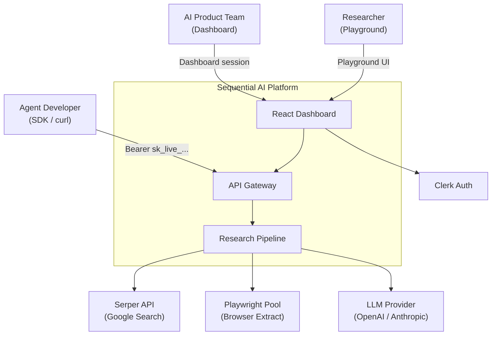

---

## 3. Monorepo Structure

Sequential AI is a **pnpm workspaces + Turborepo** monorepo. Every package is independently deployable or publishable.

```
sequential/                          ← repo root
│
├── packages/
│   ├── sdk/                         ← @sequential-ai/sdk  (published to npm)
│   └── types/                       ← @sequential-ai/types (published to npm)
│
├── server/                          ← Express API (private, deployed as Docker)
├── client/                          ← React dashboard (private, deployed to CDN)
│
├── docs/
│   ├── PRD.md
│   ├── SRS.md
│   ├── ARCHITECTURE.md              ← this file
│   ├── PROJECT_STRUCTURE.md
│   ├── SDK_GUIDE.md
│   └── API_REFERENCE.md
│
├── .github/workflows/
│   ├── ci.yml                       ← lint + typecheck + test on every PR
│   ├── publish-sdk.yml              ← npm publish on sdk/v* tag
│   └── deploy-server.yml            ← Docker build + push on main merge
│
├── pnpm-workspace.yaml
├── turbo.json
├── package.json
└── .env.example
```

### Package Dependency Graph

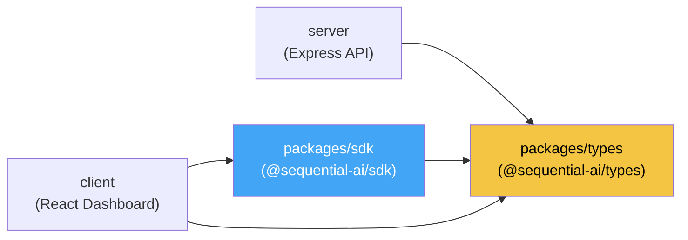

> `@sequential-ai/types` is the single source of truth for all shared TypeScript interfaces. It has zero runtime dependencies and is published separately so third-party integrators can import types without pulling in the full SDK.

---

## 4. High-Level Architecture

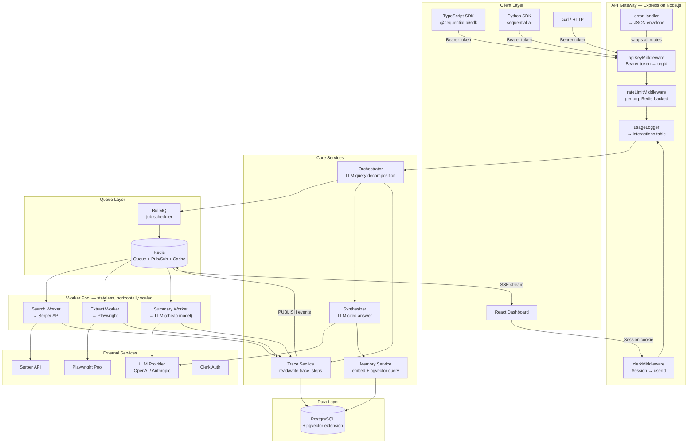

---

## 5. Request Lifecycle — Task Fan-Out Flow

This is the core pipeline that every `POST /v1/task` request goes through.

### 5.1 Step-by-Step Flow

```
Client (SDK / curl / Dashboard)
  │
  │  POST /v1/task { query, maxWorkers: 10 }
  │  Authorization: Bearer sk_live_...
  ▼
[1] API Gateway
    ├── apiKeyMiddleware: hash key → Postgres lookup → attach orgId
    ├── rateLimitMiddleware: per-org token bucket (Redis)
    ├── usageLogger: write interaction stub to Postgres
    └── create task record { status: 'running' } in tasks table
  │
  ▼
[2] Orchestrator (LLM call — cheap/fast model)
    ├── Input: raw query
    ├── Output: N sub-queries with tool assignments (search | extract)
    └── Write plan step to trace_steps
         └── PUBLISH plan event → Redis pub/sub
  │
  ▼
[3] Fan-Out via BullMQ
    ├── Enqueue Job 1: { type: 'search', subQuery: '...' }
    ├── Enqueue Job 2: { type: 'extract', url: '...' }
    └── Enqueue Job N: ...
  │
  ▼ (parallel execution — up to maxWorkers simultaneous)
  ├──[4a] Search Worker
  │         ├── Call Serper API
  │         ├── Receive ranked { url, title, excerpt }[]
  │         ├── Write search_result to trace_steps
  │         ├── PUBLISH search_result event → Redis pub/sub
  │         ├── Summary Worker: LLM summarizes result inline
  │         └── Write summary to trace_steps
  │
  ├──[4b] Extract Worker
  │         ├── Playwright: load URL in isolated browser context
  │         ├── Wait for render, extract text + tables
  │         ├── Write extract_result to trace_steps
  │         ├── PUBLISH extract_result event → Redis pub/sub
  │         ├── Summary Worker: LLM summarizes result inline
  │         └── Write summary to trace_steps
  │
  └──[4c] ... (up to maxWorkers workers run concurrently)
  │
  ▼ (once minCoverage % of workers complete)
[5] Synthesizer (LLM call — powerful model)
    ├── Input: all summaries from trace_steps
    ├── Output: cited prose answer
    ├── Write synthesis step to trace_steps
    ├── PUBLISH synthesis_chunk events → Redis pub/sub (streaming)
    └── PUBLISH done event → Redis pub/sub
  │
  ▼
[6] Memory Service
    ├── Embed synthesized answer using text-embedding-3-small
    └── Write vector to embeddings table (pgvector), scoped to orgId
  │
  ▼
[7] Update task record
    ├── status: 'completed'
    ├── answer: synthesized prose
    ├── sources: [...] (from trace_steps)
    └── usage: { workerSeconds, tokensIn, tokensOut, cost }
  │
  ▼
[8] Return TaskResult to client
    { taskId, status, answer, sources, usage, createdAt, completedAt }
```

### 5.2 Sequence Diagram

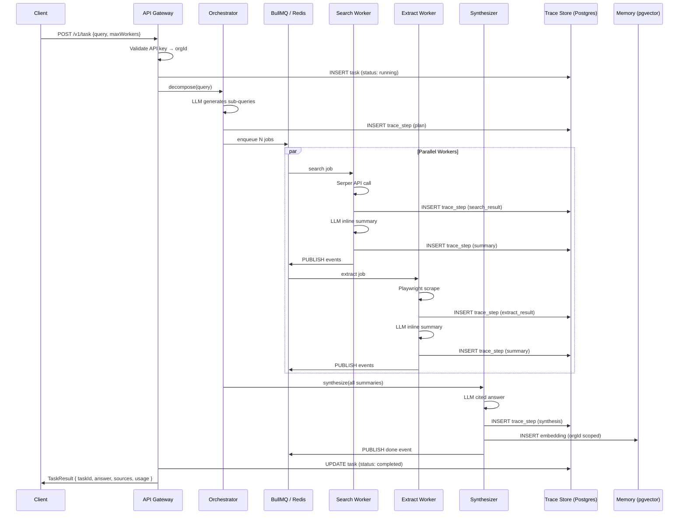

### 5.3 SSE Monitor Flow

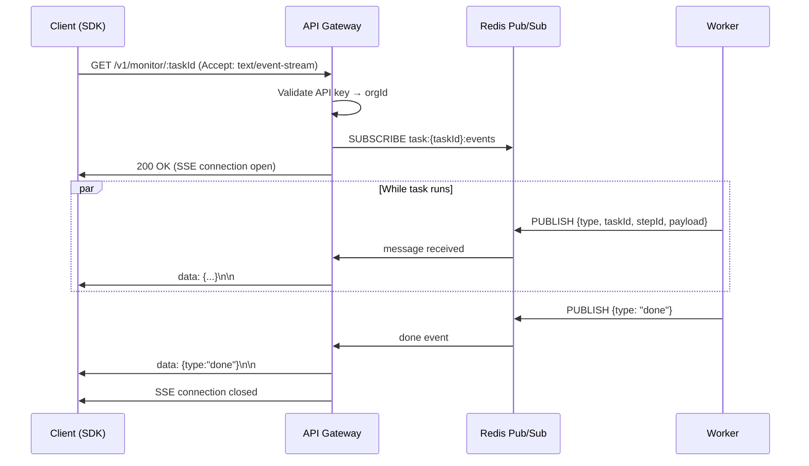

---

## 6. Component Architecture

### 6.1 API Gateway (Express)

```
server/src/
├── index.ts                ← app entry; binds port, starts workers
├── app.ts                  ← Express factory (used by tests)
├── config/
│   ├── env.ts              ← Zod-parsed env; throws at startup on missing vars
│   ├── redis.ts            ← ioredis client (shared between queue + pub/sub)
│   └── queue.ts            ← BullMQ Queue + Worker instances
├── db/
│   └── db-connection.js    ← Prisma client singleton
├── middleware/
│   ├── apiKey.ts           ← hash key → Postgres lookup → attach req.orgId
│   ├── rateLimit.ts        ← per-org token bucket (Redis-backed)
│   ├── usageLogger.ts      ← write to interactions table after response
│   └── errorHandler.ts     ← catch-all → JSON error envelope
├── routes/
│   ├── v1/                 ← API key-authenticated routes
│   │   ├── task.router.ts
│   │   ├── monitor.router.ts
│   │   ├── search.router.ts
│   │   ├── extract.router.ts
│   │   ├── memory.router.ts
│   │   ├── interactions.router.ts
│   │   └── keys.router.ts
│   └── dashboard/          ← Clerk session-authenticated routes
│       ├── tasks.router.ts
│       ├── usage.router.ts
│       └── settings.router.ts
```

**Middleware chain (v1 routes):**

```
Request
  └─► clerkMiddleware()          (sets auth context; does NOT block)
  └─► apiKeyMiddleware()         (extracts Bearer → orgId, blocks on fail)
  └─► rateLimitMiddleware()      (per-org token bucket, blocks on exceed)
  └─► usageLogger()              (records after response via res.on('finish'))
  └─► route handler
  └─► errorHandler()             (catch-all, wraps errors into JSON envelope)
```

**Key design: `env.ts` — fail fast at startup:**
```typescript
import { z } from 'zod';

const schema = z.object({
  DATABASE_URL: z.string().url(),
  REDIS_URL:    z.string().url(),
  CLERK_SECRET_KEY: z.string().min(1),
  SERPER_API_KEY:   z.string().min(1),
  OPENAI_API_KEY:   z.string().min(1),
  PORT: z.coerce.number().default(3001),
});

export const env = schema.parse(process.env);
// Throws at startup if any required var is missing — never mid-request.
```

---

### 6.2 Orchestration Engine

```
server/src/orchestrator/
├── index.ts        ← entry: accepts query → decomposes → enqueues → awaits synthesis
├── planner.ts      ← LLM call: query → [{subQuery, tool: 'search'|'extract'}]
├── fanOut.ts       ← BullMQ: enqueue one job per sub-query
└── synthesizer.ts  ← LLM call: all summaries → cited prose answer
```

**Planner prompt design:**
The planner LLM receives the original query and returns a structured JSON plan:
```json
{
  "subQueries": [
    { "query": "...", "tool": "search" },
    { "query": "...", "tool": "extract", "url": "https://..." }
  ]
}
```

**Synthesizer:**
- Receives all summary text blocks from `trace_steps` for the task
- Generates a cited prose answer (citations reference source indices)
- Streams synthesis tokens via Redis pub/sub if `stream=true`

---

### 6.3 Worker Pool

```
server/src/workers/
├── search.worker.js         ← BullMQ worker: calls Serper API
├── scraper.worker.js        ← BullMQ worker: Playwright scrape
├── openrouter.worker.js     ← BullMQ worker: OpenRouter LLM call
├── subquery.worker.js       ← BullMQ worker: Task decomposition
├── fact-extractor.worker.js ← BullMQ worker: Fact extraction
└── synthesis.worker.js      ← BullMQ worker: Synthesize answers
```

**Worker concurrency:**

| Worker Type | Default Concurrency | Max |
|---|---|---|
| Search / Scrape | 3-5 per instance (network bound) | Scales with instances |
| LLM (OpenRouter / Synthesis) | 5 per instance | Scales with instances |
| Subquery / Extract | 5 per instance | Scales with instances |

**Retry policy per job:**

```typescript
{
  attempts: 2,
  backoff: { type: 'exponential', delay: 2000 },
  removeOnComplete: { age: 3600 },
  removeOnFail: { age: 86400 },
}
```

**Failed worker behavior:**
1. Job fails → BullMQ retries once after 2 s
2. Second failure → job moves to dead-letter queue
3. Worker is excluded from synthesis; flagged in trace_steps as `status: 'failed'`
4. **No billing event is written for failed workers**

---

### 6.4 SSE / Real-Time Layer

```
server/src/sse/
├── publisher.ts    ← PUBLISH event to Redis channel task:{taskId}:events
└── stream.ts       ← Express SSE handler: SUBSCRIBE → pipe to response
```

**Key design — Redis pub/sub for multi-pod SSE:**

```
Worker Pod A                 API Pod B (handles SSE request)
    │                               │
    │ PUBLISH task:123:events        │ SUBSCRIBE task:123:events
    └──────────► Redis ─────────────► pipe to response stream
```

This means any API pod can serve the SSE request regardless of which pod started the task. No sticky sessions required.

**Event schema:**
```typescript
interface TraceEvent {
  type: MonitorEventType;
  taskId: string;
  stepId: string;
  timestamp: string;          // ISO 8601
  payload: unknown;           // typed per event type
}
```

**Event types in emission order:**
```
plan → search_start → search_result → extract_start → extract_result
     → summary → synthesis_start → synthesis_chunk* → done | error
```

---

### 6.5 Memory Service

```
server/src/services/
└── memory.ts    ← embed query/answer + pgvector similarity search
```

**Write path (automatic, on task completion):**
1. Synthesizer calls `memory.store(taskId, orgId, answerText)`
2. `answerText` is embedded via `text-embedding-3-small` → 1536-dim vector
3. Vector + metadata inserted into `embeddings` table

**Read path (`POST /v1/memory/query`):**
1. `query` string is embedded using the same model
2. `pgvector` cosine similarity search against `embeddings` WHERE `org_id = $orgId`
3. Returns top-K results with similarity scores

**Data isolation guarantee:** The `WHERE org_id = $orgId` clause is applied at the query layer AND enforced by Postgres Row Level Security — vector search cannot cross org boundaries.

---

### 6.6 Trace Service

```
server/src/services/
└── trace.ts    ← write steps to trace_steps; read full trace for a task
```

**Write (called by every worker and orchestrator):**
```typescript
trace.write({
  taskId, orgId,
  stepType: 'search_result',
  stepId: uuid(),
  input:  { subQuery },
  output: { results },
  status: 'success',
  durationMs: 1240,
});
```

**Read (called by `GET /v1/task/:id/trace`):**
```typescript
trace.getForTask(taskId, orgId)
// Returns TraceStep[] ordered by createdAt ASC
// Full tree: plan → search → extract → summary → synthesis
```

---

## 7. Data Models

### 7.1 Database Schema (Prisma ORM)

All tables live in a single PostgreSQL database with the `pgvector` extension enabled, managed by Prisma ORM (`server/prisma/schema.prisma`). The SQL schema below reflects the underlying database structure.

#### `organizations`
```sql
CREATE TABLE organizations (
  id           TEXT PRIMARY KEY,           -- Clerk org ID
  name         TEXT NOT NULL,
  plan         TEXT NOT NULL DEFAULT 'free', -- 'free' | 'paid' | 'enterprise'
  max_workers  INTEGER NOT NULL DEFAULT 5,
  created_at   TIMESTAMPTZ NOT NULL DEFAULT NOW()
);
```

#### `users`
```sql
CREATE TABLE users (
  id           TEXT PRIMARY KEY,           -- Clerk user ID
  email        TEXT NOT NULL,
  created_at   TIMESTAMPTZ NOT NULL DEFAULT NOW()
);
```

#### `org_members`
```sql
CREATE TABLE org_members (
  org_id       TEXT NOT NULL REFERENCES organizations(id),
  user_id      TEXT NOT NULL REFERENCES users(id),
  role         TEXT NOT NULL DEFAULT 'member', -- 'admin' | 'member'
  PRIMARY KEY (org_id, user_id)
);
```

#### `api_keys`
```sql
CREATE TABLE api_keys (
  id           UUID PRIMARY KEY DEFAULT gen_random_uuid(),
  org_id       TEXT NOT NULL REFERENCES organizations(id),
  name         TEXT NOT NULL,
  key_hash     TEXT NOT NULL UNIQUE,        -- bcrypt hash of plaintext key
  scopes       TEXT[] NOT NULL DEFAULT '{}',
  created_at   TIMESTAMPTZ NOT NULL DEFAULT NOW(),
  revoked_at   TIMESTAMPTZ                  -- NULL = active
);

CREATE INDEX idx_api_keys_hash ON api_keys(key_hash);
CREATE INDEX idx_api_keys_org  ON api_keys(org_id);
```

#### `tasks`
```sql
CREATE TABLE tasks (
  id              UUID PRIMARY KEY DEFAULT gen_random_uuid(),
  org_id          TEXT NOT NULL REFERENCES organizations(id),
  query           TEXT NOT NULL,
  status          TEXT NOT NULL DEFAULT 'running', -- 'running' | 'completed' | 'failed'
  answer          TEXT,
  sources         JSONB,                    -- Source[]
  usage           JSONB,                    -- Usage { workerSeconds, tokensIn, tokensOut, cost }
  max_workers     INTEGER NOT NULL DEFAULT 5,
  created_at      TIMESTAMPTZ NOT NULL DEFAULT NOW(),
  completed_at    TIMESTAMPTZ
);

CREATE INDEX idx_tasks_org_status ON tasks(org_id, status);
CREATE INDEX idx_tasks_org_created ON tasks(org_id, created_at DESC);
```

#### `trace_steps`
```sql
CREATE TABLE trace_steps (
  id           UUID PRIMARY KEY DEFAULT gen_random_uuid(),
  task_id      UUID NOT NULL REFERENCES tasks(id) ON DELETE CASCADE,
  org_id       TEXT NOT NULL,
  step_type    TEXT NOT NULL,
  -- 'plan' | 'search_start' | 'search_result' | 'extract_start' |
  -- 'extract_result' | 'summary' | 'synthesis' | 'done' | 'error'
  step_id      UUID NOT NULL,
  input        JSONB,
  output       JSONB,
  status       TEXT NOT NULL DEFAULT 'success', -- 'success' | 'failed'
  duration_ms  INTEGER,
  created_at   TIMESTAMPTZ NOT NULL DEFAULT NOW()
);

CREATE INDEX idx_trace_task    ON trace_steps(task_id, created_at ASC);
CREATE INDEX idx_trace_org     ON trace_steps(org_id);
```

#### `embeddings`
```sql
CREATE EXTENSION IF NOT EXISTS vector;

CREATE TABLE embeddings (
  id           UUID PRIMARY KEY DEFAULT gen_random_uuid(),
  task_id      UUID NOT NULL REFERENCES tasks(id) ON DELETE CASCADE,
  org_id       TEXT NOT NULL,
  content      TEXT NOT NULL,              -- the synthesized answer text
  embedding    vector(1536),               -- text-embedding-3-small output
  created_at   TIMESTAMPTZ NOT NULL DEFAULT NOW()
);

-- IVFFlat index for fast approximate nearest-neighbor search
CREATE INDEX idx_embeddings_vector ON embeddings
  USING ivfflat (embedding vector_cosine_ops) WITH (lists = 100);

CREATE INDEX idx_embeddings_org ON embeddings(org_id);
```

> **RLS policy (example):**
> ```sql
> ALTER TABLE embeddings ENABLE ROW LEVEL SECURITY;
> CREATE POLICY org_isolation ON embeddings
>   USING (org_id = current_setting('app.org_id'));
> ```

#### `interactions`
```sql
CREATE TABLE interactions (
  id           UUID PRIMARY KEY DEFAULT gen_random_uuid(),
  org_id       TEXT NOT NULL,
  endpoint     TEXT NOT NULL,              -- '/v1/task', '/v1/search', etc.
  method       TEXT NOT NULL,
  query        TEXT,
  status_code  INTEGER NOT NULL,
  tokens_in    INTEGER NOT NULL DEFAULT 0,
  tokens_out   INTEGER NOT NULL DEFAULT 0,
  cost         NUMERIC(10, 6) NOT NULL DEFAULT 0,
  duration_ms  INTEGER,
  created_at   TIMESTAMPTZ NOT NULL DEFAULT NOW()
);

CREATE INDEX idx_interactions_org_created ON interactions(org_id, created_at DESC);
CREATE INDEX idx_interactions_org_endpoint ON interactions(org_id, endpoint);
```

#### `webhooks`
```sql
CREATE TABLE webhooks (
  id           UUID PRIMARY KEY DEFAULT gen_random_uuid(),
  org_id       TEXT NOT NULL REFERENCES organizations(id),
  url          TEXT NOT NULL,
  events       TEXT[] NOT NULL DEFAULT '{}', -- ['task.completed', 'task.failed']
  secret       TEXT NOT NULL,               -- HMAC signing secret
  active       BOOLEAN NOT NULL DEFAULT TRUE,
  created_at   TIMESTAMPTZ NOT NULL DEFAULT NOW()
);
```

### 7.2 TypeScript Type System

All shared types live in `packages/types/src/`. Both the server and SDK import from this package.

#### Core Task Types

```typescript
// packages/types/src/task.ts

export interface TaskRunOptions {
  maxWorkers?: number;    // 1–20, default: 5
  stream?: boolean;       // stream synthesis tokens via SSE
}

export interface TaskResult {
  taskId:       string;
  status:       'running' | 'completed' | 'failed';
  answer:       string;
  sources:      Source[];
  usage:        Usage;
  createdAt:    string;   // ISO 8601
  completedAt?: string;
}

export interface Source {
  url:     string;
  title:   string;
  excerpt: string;
  status:  'success' | 'failed' | 'excluded';
}

export interface Usage {
  workerSeconds: number;
  tokensIn:      number;
  tokensOut:     number;
  cost:          number;    // USD
}

export interface TraceResult {
  taskId: string;
  steps:  TraceStep[];
}

export interface TraceStep {
  stepId:     string;
  stepType:   StepType;
  input:      unknown;
  output:     unknown;
  status:     'success' | 'failed';
  durationMs: number;
  createdAt:  string;
}

export type StepType =
  | 'plan'
  | 'search_start'
  | 'search_result'
  | 'extract_start'
  | 'extract_result'
  | 'summary'
  | 'synthesis'
  | 'done'
  | 'error';
```

#### Monitor / SSE Types

```typescript
// packages/types/src/monitor.ts

export type MonitorEventType =
  | 'plan'
  | 'search_start'
  | 'search_result'
  | 'extract_start'
  | 'extract_result'
  | 'summary'
  | 'synthesis_start'
  | 'synthesis_chunk'
  | 'done'
  | 'error';

export interface MonitorEvent {
  type:      MonitorEventType;
  taskId:    string;
  stepId:    string;
  timestamp: string;
  payload:   unknown;
}
```

#### Search & Extract Types

```typescript
// packages/types/src/search.ts
export interface SearchResult {
  url:     string;
  title:   string;
  excerpt: string;
  rank:    number;
}

// packages/types/src/extract.ts
export interface ExtractResult {
  url:     string;
  title:   string;
  content: string;
  status:  'success' | 'failed';
}
```

#### Memory Types

```typescript
// packages/types/src/memory.ts
export interface MemoryResult {
  taskId:     string;
  answer:     string;
  similarity: number;   // cosine similarity score 0–1
  createdAt:  string;
}
```

#### API Key Types

```typescript
// packages/types/src/common.ts
export interface ApiKey {
  id:        string;
  name:      string;
  scopes:    string[];
  createdAt: string;
  revokedAt: string | null;
}

export interface ErrorEnvelope {
  error: {
    code:       string;
    message:    string;
    retryable?: boolean;
    retryAfter?: number;
    taskId?:    string;
  };
}
```

---

## 8. API Design

### 8.1 Endpoint Map

| Method | Path | Auth | Description |
|---|---|---|---|
| `POST` | `/v1/task` | API Key | Run a parallel research task |
| `GET` | `/v1/task/:id` | API Key | Get task result by ID |
| `GET` | `/v1/task/:id/trace` | API Key | Get full step trace |
| `GET` | `/v1/monitor/:id` | API Key | SSE stream of task events |
| `GET` | `/v1/monitor` | API Key | List recent tasks (paginated) |
| `POST` | `/v1/search` | API Key | Serper search (no task overhead) |
| `POST` | `/v1/extract` | API Key | Playwright URL extraction |
| `POST` | `/v1/memory/query` | API Key | Vector memory recall |
| `GET` | `/v1/interactions` | API Key | Usage history |
| `POST` | `/v1/keys` | Clerk Session | Create API key |
| `DELETE` | `/v1/keys/:id` | Clerk Session | Revoke API key |

### 8.2 Request / Response Patterns

**Standard response headers:**
```
X-Request-Id: req_abc123
X-RateLimit-Limit: 60
X-RateLimit-Remaining: 58
X-RateLimit-Reset: 1720000000
```

**Error envelope (all errors):**
```json
{
  "error": {
    "code": "RATE_LIMIT_EXCEEDED",
    "message": "You have exceeded the rate limit for this endpoint.",
    "retryable": true,
    "retryAfter": 60
  }
}
```

**Pagination (list endpoints):**
```
GET /v1/monitor?limit=20&cursor=eyJ...&status=completed
```
```json
{
  "items": [...],
  "nextCursor": "eyJ...",
  "hasMore": true
}
```

### 8.3 SSE Wire Format

```
Content-Type: text/event-stream
Cache-Control: no-cache
Connection: keep-alive

data: {"type":"plan","taskId":"t_123","stepId":"s_1","timestamp":"...","payload":{...}}

data: {"type":"search_result","taskId":"t_123","stepId":"s_2",...}

data: {"type":"done","taskId":"t_123","stepId":"s_n",...}

```

---

## 9. Authentication & Authorization Architecture

Two completely separate auth paths coexist:

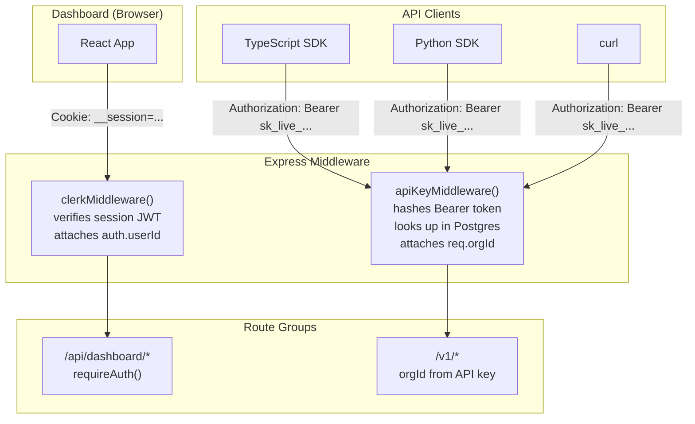

### 9.1 API Key Authentication Flow

```typescript
// server/src/middleware/apiKey.ts

export async function apiKeyMiddleware(req, res, next) {
  const raw = req.headers.authorization?.replace('Bearer ', '');
  if (!raw) return res.status(401).json({ error: { code: 'MISSING_KEY' } });

  // SHA-256 hash for lookup (faster than bcrypt verify for hot path)
  const hash = crypto.createHash('sha256').update(raw).digest('hex');
  const key  = await db.keys.findByHash(hash);

  if (!key || key.revokedAt) {
    return res.status(401).json({ error: { code: 'INVALID_KEY' } });
  }

  req.orgId  = key.orgId;
  req.scopes = key.scopes;
  next();
}
```

> **Note:** Key stored as bcrypt hash in DB for security; SHA-256 used at lookup time for performance (the bcrypt hash is pre-computed once at key creation, then the SHA-256 of the plaintext is stored separately for hot-path lookup). Alternatively, SHA-256 only is acceptable since keys are already cryptographically random.

### 9.2 API Key Lifecycle

```
POST /v1/keys
  → generate 32-byte random key: "sk_live_<base58>"
  → bcrypt hash → store in api_keys.key_hash
  → return plaintext to user ONCE (not stored)

DELETE /v1/keys/:id
  → SET revoked_at = NOW()
  → immediate effect: apiKeyMiddleware checks revoked_at
```

### 9.3 Org Isolation

Every database query in every route handler filters by `req.orgId`:

```typescript
// Example: tasks query
const task = await db.query(
  'SELECT * FROM tasks WHERE id = $1 AND org_id = $2',
  [taskId, req.orgId]
);
// If org doesn't own the task, returns 0 rows → 404/403
```

Postgres Row Level Security provides a secondary enforcement layer:
```sql
ALTER TABLE tasks ENABLE ROW LEVEL SECURITY;
CREATE POLICY org_isolation ON tasks
  USING (org_id = current_setting('app.org_id'));
```

---

## 10. Queue Architecture

### 10.1 BullMQ Setup

```typescript
// server/src/config/queue.ts
import { Queue, Worker } from 'bullmq';
import { redis } from './redis';

export const searchQueue   = new Queue('search',   { connection: redis });
export const extractQueue  = new Queue('extract',  { connection: redis });
export const summaryQueue  = new Queue('summary',  { connection: redis });
export const synthesisQueue = new Queue('synthesis', { connection: redis });
export const embeddingQueue = new Queue('embedding', { connection: redis });
export const webhookQueue  = new Queue('webhook',  { connection: redis });
```

### 10.2 Job Definitions

| Queue | Job Data | Worker Action |
|---|---|---|
| `search` | `{ taskId, orgId, subQuery, stepId }` | Call Serper API, write trace step, enqueue summary |
| `extract` | `{ taskId, orgId, url, stepId }` | Playwright scrape, write trace step, enqueue summary |
| `summary` | `{ taskId, orgId, content, stepId }` | LLM summary of single source, write trace step |
| `synthesis` | `{ taskId, orgId }` | Read all summaries from Postgres, LLM synthesis, write answer |
| `embedding` | `{ taskId, orgId, answerText }` | Embed answer, write to pgvector |
| `webhook` | `{ orgId, event, payload }` | HTTP POST to org webhook URL with HMAC signature |

### 10.3 Fan-Out Pattern

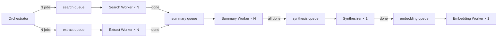

### 10.4 Redis Configuration Requirements

```yaml
# Redis must be configured with AOF persistence
redis-server --appendonly yes --appendfsync everysec
```

This ensures the BullMQ job queue survives Redis restarts without data loss.

---

## 11. SDK Architecture

### 11.1 Package Overview

```
packages/sdk/
├── src/
│   ├── index.ts              ← barrel: public exports only
│   ├── client.ts             ← Sequential class (single entry point)
│   ├── config.ts             ← ClientConfig interface + defaults
│   ├── http.ts               ← HttpClient: fetch + retry + error mapping
│   ├── errors.ts             ← SequentialError, AuthError, RateLimitError
│   ├── modules/
│   │   ├── task.ts           ← client.task.run() / .get() / .trace()
│   │   ├── monitor.ts        ← client.monitor.watch() / .list()
│   │   ├── search.ts         ← client.search()
│   │   ├── extract.ts        ← client.extract()
│   │   ├── memory.ts         ← client.memory.recall()
│   │   └── trace.ts          ← client.task.trace()
│   └── streaming/
│       ├── sse.ts            ← createSseIterator() async generator
│       └── types.ts          ← MonitorEvent union types
├── tsup.config.ts            ← dual CJS + ESM output
└── package.json              ← no runtime dependencies
```

### 11.2 Client Class Structure

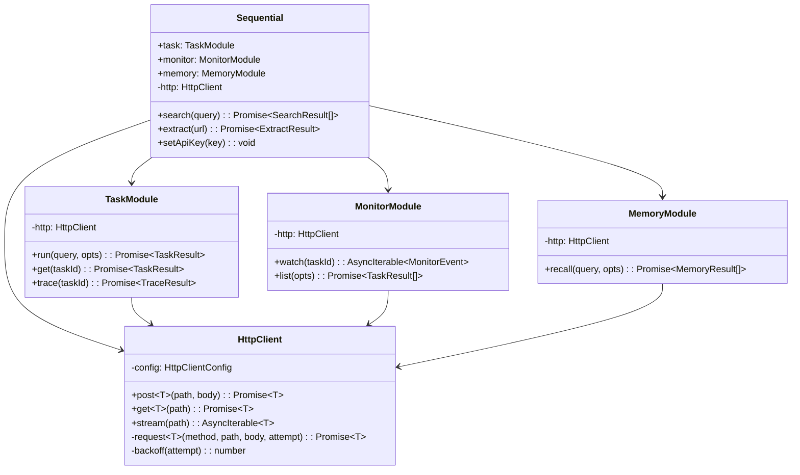

### 11.3 SSE Async Iterator

The `monitor.watch()` method returns an `AsyncIterable<MonitorEvent>` powered by a native `fetch` + `ReadableStream` pipeline. No external SSE library is required.

```
fetch(url, { Accept: 'text/event-stream' })
  └─► response.body (ReadableStream)
  └─► .pipeThrough(new TextDecoderStream())
  └─► reader.read() in a while(true) loop
  └─► buffer → split on \n → parse data: lines
  └─► yield JSON.parse(data) as MonitorEvent
  └─► break on [DONE] or reader done
```

### 11.4 Retry & Back-off

```
Attempt 1 → fail (5xx or network error)
  └─► wait: min(1000 × 2^0 + rand(0,200), 30000) ms ≈ 1.1 s
Attempt 2 → fail
  └─► wait: min(1000 × 2^1 + rand(0,200), 30000) ms ≈ 2.1 s
Attempt 3 → fail
  └─► wait: min(1000 × 2^2 + rand(0,200), 30000) ms ≈ 4.1 s
Attempt 4 → throw SequentialError (maxRetries = 3 by default)
```

| Error Class | Retryable | Behavior |
|---|---|---|
| 5xx Server Error | ✅ | Retry with backoff |
| Network timeout | ✅ | Retry with backoff |
| 429 Rate Limit | ✅ | Wait `retryAfter` seconds |
| 401/403 Auth | ❌ | Fail immediately |

### 11.5 Build Output

```
dist/
├── index.js       ← ESM (import)
├── index.cjs      ← CommonJS (require)
├── index.d.ts     ← TypeScript declarations
└── index.js.map   ← Source maps
```

**Bundle target:** `< 40 KB gzipped` · **Zero runtime dependencies** · **Node.js ≥ 18 + modern browsers**

---

## 12. Dashboard Architecture

### 12.1 Page Structure

```
client/src/
├── App.tsx                     ← ClerkProvider + Router
├── pages/
│   ├── playground/
│   │   ├── TaskPage.tsx        ← query input + maxWorkers slider + live trace
│   │   ├── MonitorPage.tsx     ← task list + click-to-trace
│   │   ├── MemoryPage.tsx      ← vector memory search
│   │   └── TracePage.tsx       ← full step tree view
│   ├── tools/
│   │   ├── SearchPage.tsx      ← standalone Serper search
│   │   └── ExtractPage.tsx     ← standalone Playwright extract
│   └── workspace/
│       ├── WorkersPage.tsx     ← worker concurrency config
│       ├── InteractionsPage.tsx ← usage history + CSV export
│       └── ConfigurePage.tsx   ← API keys + webhooks + members + billing
├── components/
│   ├── TracePanel/             ← SSE-driven live trace tree
│   ├── TaskResult/             ← Markdown answer + citation renderer
│   ├── WorkerBar/              ← active workers progress bar
│   └── CodeBlock/              ← "Copy as SDK call" component
└── hooks/
    ├── useTaskStream.ts        ← wraps SSE to /v1/monitor/:id
    ├── useApiKeys.ts
    └── useUsage.ts
```

### 12.2 Task Playground Data Flow

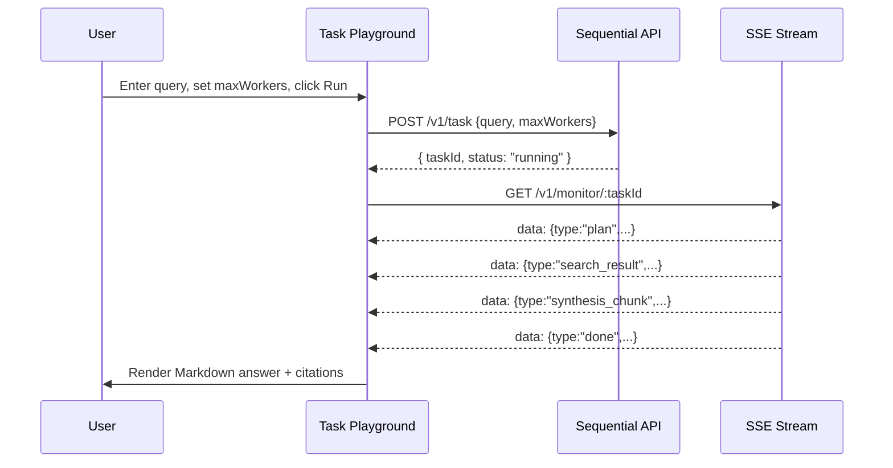

### 12.3 Auth Flow (Dashboard)

```
User opens dashboard
  └─► ClerkProvider checks for session cookie
  └─► If no session → redirect to /sign-in (Clerk-hosted)
  └─► User completes auth (OAuth / magic link / password)
  └─► Clerk issues session JWT in httpOnly cookie
  └─► All dashboard API calls include session cookie
  └─► Express: clerkMiddleware() verifies JWT → attaches auth.userId
  └─► Dashboard routes use Clerk org_id to scope API key lookups
```

---

## 13. Infrastructure & Deployment

### 13.1 Deployment Architecture

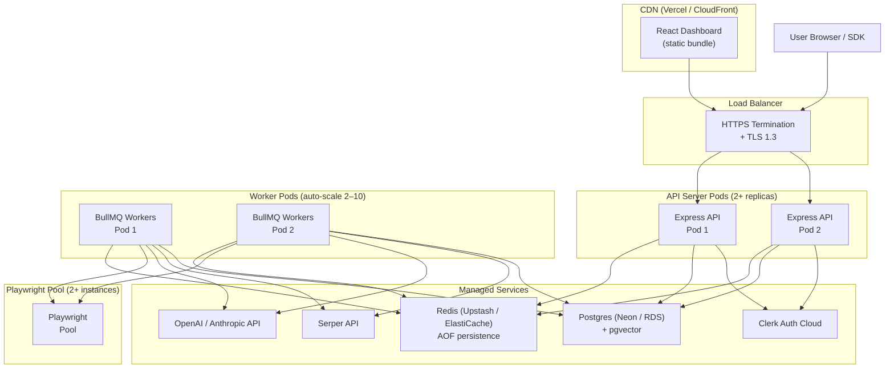

### 13.2 Container Strategy

**API Server + Worker (same Docker image, different start command):**

```dockerfile
FROM node:20-alpine AS base
WORKDIR /app
COPY pnpm-lock.yaml pnpm-workspace.yaml ./
RUN corepack enable && pnpm install --frozen-lockfile

FROM base AS build
COPY . .
RUN pnpm --filter server build

FROM node:20-alpine AS production
WORKDIR /app
COPY --from=build /app/server/dist ./dist
COPY --from=build /app/server/package.json .

# API server
CMD ["node", "dist/index.js"]
# OR workers (separate Kubernetes Deployment):
# CMD ["node", "dist/workers/index.js"]
```

### 13.3 Infrastructure Sizing (v1)

| Component | Minimum | Notes |
|---|---|---|
| API Server | 2 vCPU / 2 GB RAM × 2 pods | Stateless; scales horizontally |
| Worker Pool | 2 vCPU / 4 GB RAM × 2–10 pods | Auto-scale on queue depth |
| Playwright Pool | 4 vCPU / 8 GB RAM × 2+ pods | CPU/RAM heavy; scale separately |
| Postgres | 4 vCPU / 8 GB RAM / 100 GB SSD | Managed (Neon or RDS) |
| Redis | 2 GB RAM | Managed (Upstash or ElastiCache) with AOF |

### 13.4 CI/CD Pipeline

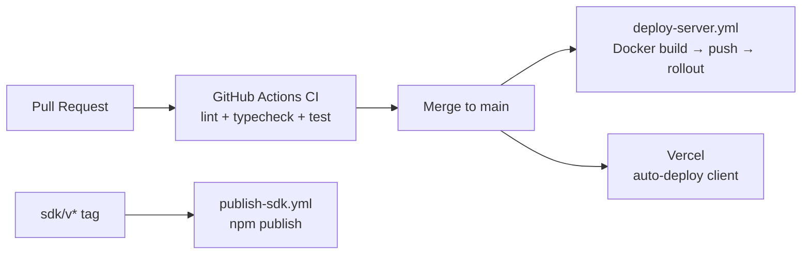

**CI jobs (run on every PR):**
1. `lint-typecheck` — ESLint + `tsc --noEmit` across all packages
2. `test` — Vitest unit + integration tests (with Postgres + Redis Docker services)
3. `build` — `turbo build` across all packages

---

## 14. Security Architecture

### 14.1 Transport Security

- TLS 1.3 enforced on all endpoints (terminated at load balancer)
- HSTS header: `Strict-Transport-Security: max-age=31536000; includeSubDomains`
- No HTTP → HTTPS redirect; HTTP simply refused

### 14.2 API Key Security

```
Key generation:
  crypto.randomBytes(32) → base58 encode → "sk_live_<48-char string>"

Storage:
  SHA-256 hash stored in api_keys.key_hash for hot-path lookup
  bcrypt hash optionally stored for display verification

Revocation:
  SET revoked_at = NOW()
  apiKeyMiddleware checks revoked_at on every request
  No caching of key lookup — always hits Postgres (can add Redis cache with 30s TTL)
```

### 14.3 Playwright Sandboxing

Each Playwright extraction runs in an isolated context:
```typescript
const context = await browser.newContext({
  // New isolated context per extraction
  storageState: undefined,
  // Block resource types that could leak data
  extraHTTPHeaders: {},
});
const page = await context.newPage();
// ... extract ...
await context.close(); // context is destroyed after extraction
```

- No cookies or storage shared between extractions
- No access to other contexts' network requests
- Context destroyed immediately after extraction completes

### 14.4 Secrets Management

| Secret | Storage | Access |
|---|---|---|
| `DATABASE_URL` | Environment variable | API server + workers only |
| `REDIS_URL` | Environment variable | API server + workers only |
| `SERPER_API_KEY` | Environment variable | Workers only |
| `OPENAI_API_KEY` | Environment variable | Workers only |
| `CLERK_SECRET_KEY` | Environment variable | API server only |
| `API_KEY_SALT` | Environment variable | API server only |
| Webhook signing secrets | Postgres `webhooks.secret` | API server only |

**No secrets in source code. No secrets in Docker images. Secrets injected at runtime via platform environment.**

### 14.5 Rate Limiting

```typescript
// Per-org token bucket, stored in Redis
// Key: ratelimit:{orgId}:{endpoint}
// Algorithm: sliding window

const LIMITS = {
  free: { task: 5, search: 20, extract: 10, memory: 10 },   // per minute
  paid: { task: 60, search: 200, extract: 100, memory: 100 },
};
```

---

## 15. Observability Architecture

### 15.1 Structured Logging

Every request log entry includes:
```json
{
  "timestamp": "2026-07-15T10:00:00Z",
  "level": "info",
  "requestId": "req_abc123",
  "orgId": "org_xyz",
  "method": "POST",
  "path": "/v1/task",
  "statusCode": 200,
  "durationMs": 18432,
  "taskId": "task_def456"
}
```

### 15.2 Distributed Tracing

OpenTelemetry spans are emitted for all service boundaries:

```
POST /v1/task
  └─► span: api.request
       └─► span: orchestrator.decompose
            └─► span: llm.plan (model=gpt-4o-mini)
       └─► span: queue.fanout (jobs=8)
       └─► span: synthesizer.run (model=gpt-4o)
            └─► span: llm.synthesis
       └─► span: memory.store
```

### 15.3 Metrics (Prometheus)

Exposed at `/metrics`:

| Metric | Type | Labels |
|---|---|---|
| `api_requests_total` | Counter | method, path, status |
| `api_request_duration_ms` | Histogram | method, path |
| `task_completed_total` | Counter | status |
| `task_duration_ms` | Histogram | worker_count |
| `worker_job_total` | Counter | queue, status |
| `worker_job_duration_ms` | Histogram | queue |
| `queue_depth` | Gauge | queue |
| `llm_tokens_total` | Counter | model, type (in/out) |

### 15.4 Alerting Thresholds (PagerDuty)

| Alert | Threshold | Severity |
|---|---|---|
| API uptime | < 99.9% per 5-min window | P1 |
| Error rate | > 5% of requests in 5 min | P1 |
| Task failure rate | > 5% in 10 min | P2 |
| Queue depth (any queue) | > 500 jobs for > 5 min | P2 |
| P95 latency (non-LLM) | > 500 ms for > 5 min | P2 |
| Worker pod count | < 2 pods for > 2 min | P1 |

---

## 16. Scalability Design

### 16.1 Horizontal Scaling Points

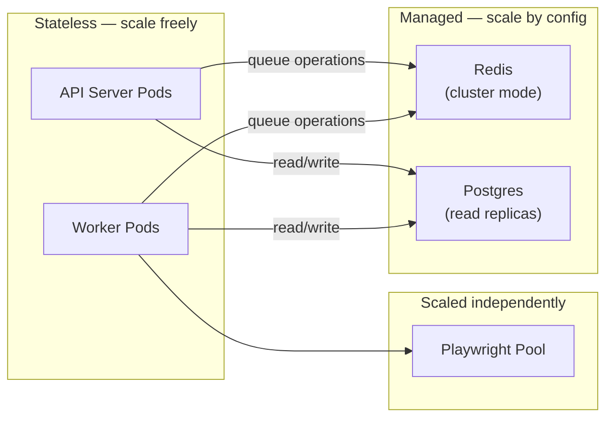

### 16.2 Scaling Triggers

| Component | Trigger | Action |
|---|---|---|
| API Pods | CPU > 70% or request queue > 100 | Add pod (min: 2, max: 20) |
| Worker Pods | BullMQ queue depth > 50 per pod | Add pod (min: 2, max: 10) |
| Playwright Pool | Extract queue depth > 10 | Add Playwright instance |

### 16.3 Database Scalability Path

**v1:** Single Postgres instance with pgvector

**v2 (if scale demands):**
- Read replicas for `trace_steps` and `interactions` (high read traffic)
- Partition `trace_steps` by `created_at` (time-series data)
- Migrate embeddings to dedicated vector DB (Pinecone, Weaviate, Qdrant) if `ivfflat` performance degrades

**pgvector index config for v1:**
```sql
CREATE INDEX ON embeddings USING ivfflat (embedding vector_cosine_ops)
  WITH (lists = 100);
-- lists = sqrt(row_count) is the recommended starting point
-- Set at 100 for ~10K embeddings; increase to 1000 at ~1M embeddings
```

---

## 17. External Service Integrations

### 17.1 Serper API

```
POST https://google.serper.dev/search
Authorization: X-API-KEY {SERPER_API_KEY}
Content-Type: application/json

{ "q": "fusion energy breakthroughs 2026", "num": 10 }
```

**Response mapping:**
```typescript
// server/src/services/serper.ts
interface SerperResponse {
  organic: Array<{
    title:   string;
    link:    string;
    snippet: string;
    position: number;
  }>;
}

// Maps to SearchResult[]
```

**Retry:** 2 attempts with 1s backoff on 5xx.
**Circuit breaker:** If Serper fails > 50% of requests in a 1-minute window, worker is marked degraded and tasks continue with remaining workers.

### 17.2 Playwright Pool

```typescript
// server/src/services/playwright.ts

// Pool of browser instances (shared across requests)
const pool = new PlaywrightPool({ min: 2, max: 20 });

async function extract(url: string): Promise<ExtractResult> {
  const context = await pool.acquireContext();  // isolated context
  try {
    const page = await context.newPage();
    await page.goto(url, { timeout: 30_000, waitUntil: 'networkidle' });
    const content = await page.evaluate(() => document.body.innerText);
    const title   = await page.title();
    return { url, title, content, status: 'success' };
  } finally {
    await context.close();  // always release
  }
}
```

**Timeout:** 30 s per extraction. Timed-out extractions are flagged as `failed` in trace_steps.

### 17.3 LLM Provider

```typescript
// server/src/services/llm.ts
// Provider-agnostic abstraction

interface LLMProvider {
  complete(prompt: string, options: LLMOptions): Promise<string>;
  stream(prompt: string, options: LLMOptions): AsyncIterable<string>;
}

// Implementations: OpenAIProvider | AnthropicProvider
// Selected by LLM_PROVIDER env var
```

**Model routing:**
| Task | Model | Reason |
|---|---|---|
| Query decomposition (Planner) | GPT-4o-mini / Claude 3 Haiku | Fast, cheap, structured output |
| Inline summary (Summary Worker) | GPT-4o-mini / Claude 3 Haiku | Fast, cheap, 1 source at a time |
| Final synthesis (Synthesizer) | GPT-4o / Claude 3.5 Sonnet | High quality, cited prose |
| Embedding | `text-embedding-3-small` | 1536-dim, cheap, fast |

---

## 18. Error Handling Architecture

### 18.1 Error Taxonomy

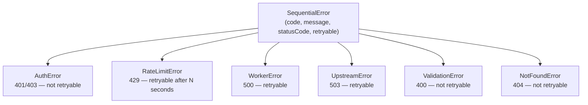

### 18.2 Error Propagation

```
Worker failure
  └─► BullMQ marks job failed
  └─► Worker writes trace_step { status: 'failed' }
  └─► Worker does NOT write billing event
  └─► BullMQ retries once (after 2s)
  └─► If second failure → dead-letter queue
  └─► Orchestrator detects worker failure
  └─► If minCoverage still met → continue to synthesis
  └─► If not met → mark task as 'failed'

API error
  └─► errorHandler middleware catches
  └─► Maps to ErrorEnvelope { code, message, retryable, ... }
  └─► Returns appropriate HTTP status
  └─► Logs full stack trace (internal only)
```

### 18.3 Error Envelope

```json
{
  "error": {
    "code": "WORKER_TIMEOUT",
    "message": "Extract worker timed out after 30s for URL https://example.com",
    "taskId": "task_abc123",
    "retryable": true
  }
}
```

---

## 19. Decision Log

| # | Decision | Choice | Rationale |
|---|---|---|---|
| D1 | Monorepo vs. multi-repo | **Monorepo (pnpm workspaces + Turborepo)** | Type sharing between server/SDK without publishing; one CI pipeline; atomic cross-package PRs |
| D2 | Dashboard auth | **Clerk** | Ships auth in a day; org/member model maps directly; SOC 2 ready; not a differentiator |
| D3 | API auth | **Custom (Postgres-backed hashed keys)** | API keys are the product; Clerk does not manage arbitrary API keys |
| D4 | Queue | **Redis + BullMQ** | Native fan-out; horizontal scaling; built-in job visibility, retry, dead-letter; no separate broker |
| D5 | Vector DB | **pgvector (Postgres extension)** | Eliminates separate operational dependency; ivfflat sufficient for early scale; migratable |
| D6 | SSE multi-pod | **Redis pub/sub relay** | Any pod can serve SSE; no sticky sessions; scales with API server pods |
| D7 | SDK bundler | **tsup** | Fastest TS bundler; dual CJS/ESM output; auto d.ts generation; zero config |
| D8 | SDK dependencies | **Zero runtime deps** | Native `fetch` (Node 18+); small bundle; no supply-chain risk |
| D9 | LLM abstraction | **Provider-agnostic `LLMProvider` interface** | Swap OpenAI ↔ Anthropic without code changes; hedge vendor risk |
| D10 | Worker deployment | **Same Docker image, different start command** | Simplified CI/CD; shared build artifact; workers scale independently |
| D11 | Postgres vs. separate log pipeline | **Postgres for all trace data** | One DB; no extra operational surface; trace data is queried, not just ingested |
| D12 | Billing enforcement | **At infrastructure layer (billing event only on success)** | Failed workers are architecturally free — not a policy applied after the fact |

---

*End of ARCHITECTURE.md v1.0*
