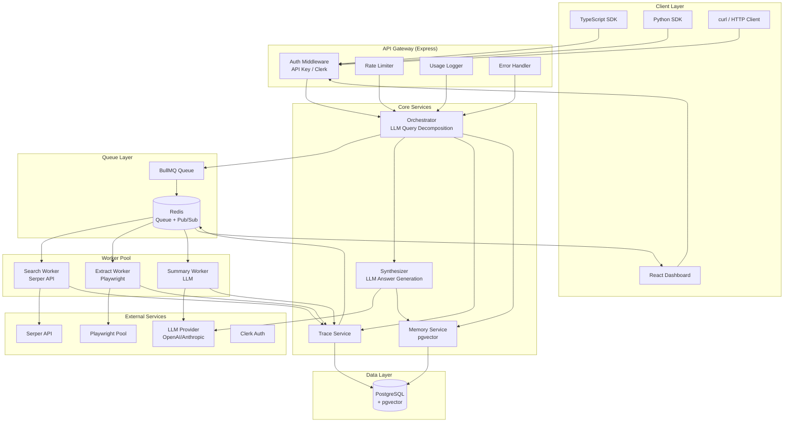
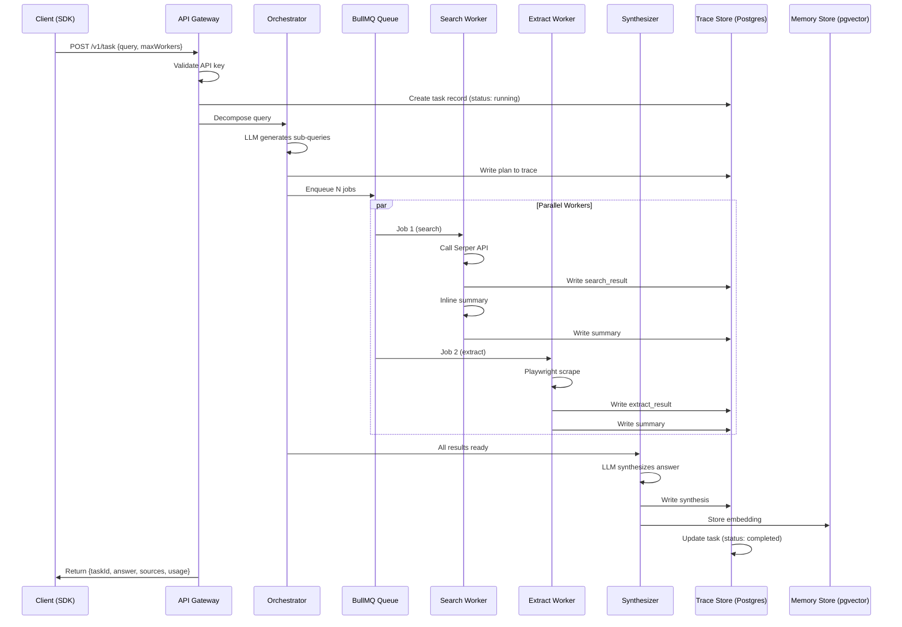
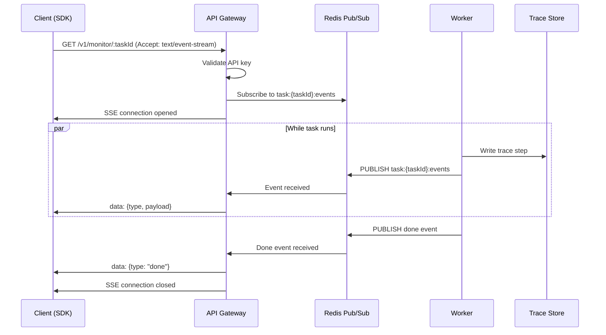
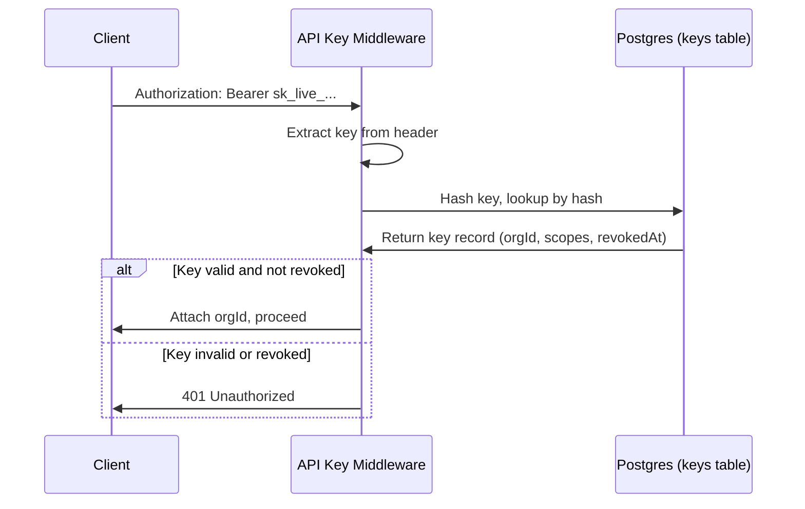
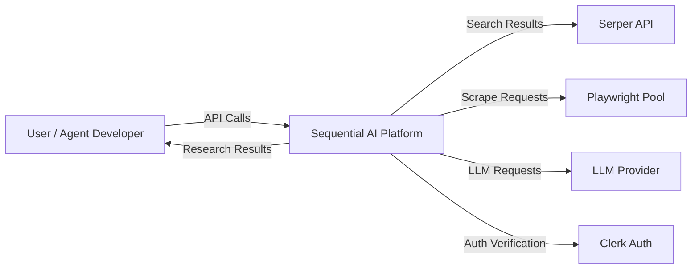

# Sequential AI — Software Requirements Specification

| Field | Value |
|---|---|
| **Version** | 1.0 |
| **Status** | Draft |
| **Date** | July 15, 2026 |
| **Prepared by** | Kilo (Senior Software Architect / Business Analyst / Product Manager / Technical Writer) |
| **Based on** | PRD v1.0, PROJECT_STRUCTURE v1.0, SDK_GUIDE v1.0 |

---

## Table of Contents

1. [Executive Summary](#1-executive-summary)
2. [Project Overview](#2-project-overview)
3. [Problem Statement](#3-problem-statement)
4. [Vision and Objectives](#4-vision-and-objectives)
5. [Business Goals](#5-business-goals)
6. [Target Users & User Personas](#6-target-users--user-personas)
7. [Stakeholders](#7-stakeholders)
8. [Scope](#8-scope)
9. [In Scope](#9-in-scope)
10. [Out of Scope](#10-out-of-scope)
11. [Functional Requirements](#11-functional-requirements)
12. [Non-Functional Requirements](#12-non-functional-requirements)
13. [System Architecture Overview](#13-system-architecture-overview)
14. [High-Level Component Diagram](#14-high-level-component-diagram)
15. [Sequence Diagrams](#15-sequence-diagrams)
16. [Data Flow Diagrams](#16-data-flow-diagrams)
17. [Database Design](#17-database-design)
18. [API Specifications](#18-api-specifications)
19. [Authentication & Authorization](#19-authentication--authorization)
20. [Roles & Permissions Matrix](#20-roles--permissions-matrix)
21. [Business Rules](#21-business-rules)
22. [Validation Rules](#22-validation-rules)
23. [Error Handling Strategy](#23-error-handling-strategy)
24. [Logging & Monitoring](#24-logging--monitoring)
25. [Notifications](#25-notifications)
26. [Third-Party Integrations](#26-third-party-integrations)
27. [Environment Variables](#27-environment-variables)
28. [Deployment Architecture](#28-deployment-architecture)
29. [Infrastructure Requirements](#29-infrastructure-requirements)
30. [Security Requirements](#30-security-requirements)
31. [Privacy Considerations](#31-privacy-considerations)
32. [Performance Benchmarks](#32-performance-benchmarks)
33. [Rate Limits](#33-rate-limits)
34. [Caching Strategy](#34-caching-strategy)
35. [Background Jobs](#35-background-jobs)
36. [File Storage](#36-file-storage)
37. [Search Requirements](#37-search-requirements)
38. [Analytics Requirements](#38-analytics-requirements)
39. [AI/LLM Components](#39-aillm-components)
40. [Risks & Assumptions](#40-risks--assumptions)
41. [Dependencies](#41-dependencies)
42. [Acceptance Criteria](#42-acceptance-criteria)
43. [User Stories](#43-user-stories)
44. [Use Cases](#44-use-cases)
45. [Future Roadmap](#45-future-roadmap)
46. [Glossary](#46-glossary)

---

## 1. Executive Summary

Sequential AI is a **parallel web-research API platform** purpose-built for AI agents and agent frameworks. The platform fans a single research query across a pool of parallel workers — each independently searching and extracting content — then synthesizes everything into a single cited answer with full observability.

### Core Products

| Product | Description |
|---|---|
| **Task API** | Accepts a research query, fans it out across parallel Search + Extract workers, synthesizes an answer with citations |
| **Monitor API** | Streams a real-time trace of every step inside a running (or completed) task over SSE |

**Tech Stack:** Prisma ORM + PostgreSQL + pgvector · Express (Node.js) · React · Redis + BullMQ · TypeScript · pnpm Workspaces + Turborepo

**Monetization:** Free at baseline. Usage-based pricing for persistent memory, higher worker concurrency, and extended trace retention.

**Target Market:** AI agent developers, AI product teams, and researchers building on LangChain, CrewAI, or custom orchestration frameworks.

---

## 2. Project Overview

Sequential AI is a monorepo-based SaaS platform organized into four main packages:

| Package | Location | Purpose |
|---|---|---|
| `server` | `/server` | Express API server (private) |
| `client` | `/client` | React dashboard (private) |
| `packages/sdk` | `/packages/sdk` | TypeScript SDK — `@sequential-ai/sdk` (published to npm) |
| `packages/types` | `/packages/types` | Shared TypeScript types — `@sequential-ai/types` (published to npm) |

The platform provides a **fan-out research pipeline** where a single query is:

1. Decomposed into sub-queries
2. Executed in parallel across search and extraction workers
3. Summarized inline per source
4. Synthesized into a single cited answer

Every step is traced and can be monitored in real-time.

---

## 3. Problem Statement

### 3.1 The Sequential Bottleneck

Today's AI agents research the web sequentially: fetch one URL, extract text, move to the next. This creates three compounding problems:

- **Latency:** A 10-source research job at 3 s/source = 30 s minimum, before synthesis.
- **Coverage gaps:** Plain HTTP fetches fail on JavaScript-rendered pages (SPAs, paywalled content, dynamic tables). Agents using `requests` or `fetch` miss a significant fraction of the modern web.
- **Opacity:** No standard way for an agent operator to observe what an agent-driven research job actually did — which sources it hit, which failed, what intermediate summaries looked like.

### 3.2 What Competitors Provide (and Don't)

| Competitor | Provides | Missing |
|---|---|---|
| Perplexity / You.com / Tavily | Single-call research APIs | No concurrency control, no per-step trace, no memory across calls |
| Raw Serper / SerpAPI | Search-only | No orchestration or extraction |
| Browser automation (Browserless, Playwright-as-a-service) | Extraction-only | No orchestration or search |
| LangChain / CrewAI tools | Bring-your-own-key wrappers | Still execute sequentially |

> **Gap:** No existing product gives agent developers: parallelism + observability + memory + a typed SDK that handles streaming traces.

### 3.3 The Opportunity

There is a clear gap for a platform that treats **parallel research as a first-class primitive** and exposes it through a developer-grade API with full observability — the same way Stripe treated payments as a first-class primitive.

---

## 4. Vision and Objectives

### 4.1 Vision

> Sequential AI is the research infrastructure layer for AI agents — the platform that lets any agent do deep, parallel, cited web research in a single API call, with full observability into what happened and memory of what it learned.

### 4.2 Objectives (v1)

| # | Objective | Success Metric |
|---|---|---|
| O1 | Make parallel research a one-line API call | Task API ships with TS + Python SDK |
| O2 | Give operators full transparency into agent research steps | Monitor API streams every step live |
| O3 | Persist research findings across calls | Memory API stores + recalls embeddings |
| O4 | Be priced so agents can call us liberally | Task + Monitor + basic Search/Extract free; metered for power use |
| O5 | Support the major agent frameworks on day one | LangChain + CrewAI integrations in Python SDK |

---

## 5. Business Goals

| # | Business Goal | KPI | Target |
|---|---|---|---|
| BG1 | Acquisition | Registered developer accounts (90-day) | 500 |
| BG2 | Acquisition | SDK installs, npm + PyPI (90-day) | 1,000 |
| BG3 | Acquisition | Docs page unique visitors/month | 2,000 |
| BG4 | Activation | % of signups who run a Task within 24 h | > 40% |
| BG5 | Activation | % of signups who run > 5 tasks | > 20% |
| BG6 | Retention | Weekly active API users | 100 |
| BG7 | Monetisation | Paid conversions (any metered usage) | 25 |
| BG8 | Monetisation | Average metered revenue per paying account | $30/month |
| BG9 | Quality | Source coverage rate | > 90% |
| BG10 | Quality | Failed-task rate | < 2% |
| BG11 | Quality | SDK bug reports blocking usage (P0) | 0 open |

---

## 6. Target Users & User Personas

### 6.1 Primary: Agent Developer (API-first)

- Builds AI agents or agent pipelines in Python or TypeScript
- Integrates Sequential via SDK; cares about latency, reliability, typed responses
- Needs to debug agent behaviour → Monitor API is a differentiator
- Likely already using LangChain, CrewAI, or a custom orchestration framework

### 6.2 Secondary: AI Product Team

- Building a product on top of agents (e.g., AI research assistant, competitive intel tool)
- Uses the Dashboard to monitor usage, inspect traces, and tune concurrency
- May use webhooks to pipe task results into their own backend

### 6.3 Tertiary: Researcher / Solo Builder

- Uses the Playground UI as a no-code research tool
- May not write SDK code at all; uses the dashboard's Task playground directly
- Monetised through the free tier; eventual conversion on memory/concurrency

---

## 7. Stakeholders

| Role | Name/Team | Responsibility |
|---|---|---|
| Product Owner | Product Team | Feature prioritization, roadmap, PRD ownership |
| Engineering Lead | Engineering | Technical architecture, code review, deployment |
| Frontend Engineer | Engineering | Dashboard UI, React components |
| Backend Engineer | Engineering | API server, workers, database, queue |
| SDK Engineer | Engineering | TypeScript + Python SDK design and maintenance |
| DevOps Engineer | Engineering | CI/CD, infrastructure, monitoring |
| QA Engineer | QA | Test plans, acceptance criteria, bug verification |
| Security Engineer | Engineering | Auth, data isolation, compliance |
| Investors / Board | Business | Strategic oversight, funding decisions |

---

## 8. Scope

Sequential AI is a parallel web-research API platform with the following scope:

- **API Layer:** RESTful API with SSE streaming for real-time monitoring
- **Orchestration Layer:** LLM-based query decomposition and fan-out to parallel workers
- **Worker Layer:** Search (Serper), Scrape (Playwright), OpenRouter, SubQuery, FactExtractor, Synthesis
- **API Gateway:** Express.js routing, Clerk middleware, API key validation, rate limiting
- **Storage Layer:** PostgreSQL for relational data, pgvector for embeddings
- **Infrastructure:** Prisma ORM, PostgreSQL + pgvector, Redis + BullMQ, Docker-based deployment

---

## 9. In Scope

### 9.1 Core APIs

| API | Endpoint | Description |
|---|---|---|
| Task API | `POST /v1/task` | Run a research task with parallel workers |
| Task API | `GET /v1/task/:id` | Get task result by ID |
| Task API | `GET /v1/task/:id/trace` | Get full step trace for a task |
| Monitor API | `GET /v1/monitor/:id` | SSE stream of task events |
| Search API | `POST /v1/search` | Direct search via Serper |
| Extract API | `POST /v1/extract` | Direct URL extraction via Playwright |
| Memory API | `POST /v1/memory/query` | Vector memory recall via pgvector |
| Interactions API | `GET /v1/interactions` | Usage history |
| Keys API | `POST /v1/keys` | Create API key |
| Keys API | `DELETE /v1/keys/:id` | Revoke API key |

### 9.2 Dashboard Pages

| Page | Route | Description |
|---|---|---|
| Task Playground | `/playground/task` | Run tasks, watch live trace, see results |
| Monitor | `/playground/monitor` | List live/past tasks, filter by status |
| Memory | `/playground/memory` | Searchable log of past task embeddings |
| Trace | `/playground/trace` | Full step tree for any task |
| Search Tool | `/tools/search` | Query box → ranked URL results |
| Extract Tool | `/tools/extract` | URL input → clean text output |
| Workers | `/workspace/workers` | Active workers, concurrency config |
| Interactions | `/workspace/interactions` | Full API call history |
| Configure | `/workspace/configure` | API keys, webhooks, org members, billing |

### 9.3 SDKs

| SDK | Package | Language |
|---|---|---|
| TypeScript SDK | `@sequential-ai/sdk` | TypeScript (Node.js + Browser) |
| Python SDK | `sequential-ai` | Python (LangChain + CrewAI integration) |
| Shared Types | `@sequential-ai/types` | TypeScript (zero dependencies) |

---

## 10. Out of Scope

| Item | Reason |
|---|---|
| Self-hosted / air-gapped deployment | v1 is SaaS-only; defer to enterprise tier |
| Enterprise SSO (SAML, OIDC) | Not a differentiator; use Clerk for v1 |
| Custom tool plugins | Post-v1 feature |
| Structured output (JSON schema) | Post-v1 feature |
| Recurring Monitor (cron) | Post-v1 feature |
| LlamaIndex integration | Post-v1 (LangChain + CrewAI for v1) |
| EU data residency | Post-v1 (Low priority) |
| Mobile apps | Not in scope for v1 |
| Browser extension | Not in scope for v1 |

---

## 11. Functional Requirements

### 11.1 Task API Module

---

#### FR-TASK-001: Run Research Task

| Field | Value |
|---|---|
| **Requirement ID** | FR-TASK-001 |
| **Priority** | Critical |

**Description:** Accept a research query and execute a parallel fan-out research pipeline.

**Preconditions:**
- User has a valid API key
- API key has not exceeded rate limits
- `query` parameter is provided and non-empty

**Main Flow:**
1. Client sends `POST /v1/task` with `query`, optional `maxWorkers` (1–20, default 5), optional `stream` (boolean)
2. Server validates API key and extracts `orgId`
3. Server creates a task record in Postgres with `status: running`
4. Orchestrator LLM decomposes query into N sub-queries
5. Each sub-query is enqueued as a job onto BullMQ
6. Worker pool pulls jobs and executes in parallel:
   - Search workers call Serper API
   - Extract workers call Playwright
   - Summary workers summarize each result inline
7. Each step is written to the trace store (Postgres) and published to Redis pub/sub
8. Once all (or `minCoverage`-percent of) workers complete, synthesis LLM runs
9. Synthesized answer with citations is written to the task record
10. Memory embedding is written to pgvector
11. Final task result is returned to client

**Alternate Flows:**
- **Streaming** (`stream=true`): Synthesis tokens are streamed to the client as they are generated via SSE
- **Partial coverage:** If `minCoverage` threshold is met, synthesis runs even if some workers failed

**Exceptions:**

| Condition | Response |
|---|---|
| Invalid API key | `401 Unauthorized` |
| Rate limit exceeded | `429 Too Many Requests` |
| Invalid query (empty/null) | `400 Bad Request` |
| Orchestrator LLM failure | `500 Internal Server Error` |
| All workers fail | Task marked `failed`, no billing |

**Acceptance Criteria:**
- Task completes with `status: completed` and returns `answer`, `sources`, `taskId`, `usage`
- Failed workers are retried once, then excluded and flagged
- Failed sources are not billed
- Memory embedding is written automatically on completion

---

#### FR-TASK-002: Get Task Result

| Field | Value |
|---|---|
| **Requirement ID** | FR-TASK-002 |
| **Priority** | High |

**Description:** Retrieve the result of a completed task by ID.

**Preconditions:**
- Task ID exists
- API key belongs to the same org as the task

**Main Flow:**
1. Client sends `GET /v1/task/:id`
2. Server validates API key and org membership
3. Server retrieves task from Postgres
4. Server returns `TaskResult` object

**Exceptions:**

| Condition | Response |
|---|---|
| Task not found | `404 Not Found` |
| Org mismatch | `403 Forbidden` |

**Acceptance Criteria:**
- Returns `taskId`, `status`, `answer`, `sources`, `usage`, `createdAt`, `completedAt`

---

#### FR-TASK-003: Get Task Trace

| Field | Value |
|---|---|
| **Requirement ID** | FR-TASK-003 |
| **Priority** | High |

**Description:** Retrieve the full step-by-step trace for a completed task.

**Preconditions:**
- Task ID exists
- Task has completed (or failed)
- API key belongs to the same org as the task

**Main Flow:**
1. Client sends `GET /v1/task/:id/trace`
2. Server validates API key and org membership
3. Server retrieves all trace steps from Postgres
4. Server returns `TraceResult` with full tree

**Exceptions:**

| Condition | Response |
|---|---|
| Task not found | `404 Not Found` |
| Trace not yet available | `202 Accepted` with `status: running` |

**Acceptance Criteria:**
- Returns ordered list of trace steps: `plan → search → extract → summary → synthesis`
- Exportable as JSON

---

### 11.2 Monitor API Module

---

#### FR-MONITOR-001: Stream Task Events (SSE)

| Field | Value |
|---|---|
| **Requirement ID** | FR-MONITOR-001 |
| **Priority** | Critical |

**Description:** Stream real-time trace events for a running or completed task via Server-Sent Events.

**Preconditions:**
- Task ID exists
- API key belongs to the same org as the task

**Main Flow:**
1. Client sends `GET /v1/monitor/:id` with `Accept: text/event-stream`
2. Server validates API key and org membership
3. Server opens SSE connection
4. Worker publishes events to Redis pub/sub channel `task:{taskId}:events`
5. Express SSE subscriber receives events and streams them to client
6. Events emitted in order: `plan`, `search_start`, `search_result`, `extract_start`, `extract_result`, `summary`, `synthesis_start`, `synthesis_chunk`, `done`, `error`

**Alternate Flows:**
- **Watch completed task:** If task is already done, server replays trace events from Postgres before closing

**Exceptions:**

| Condition | Response |
|---|---|
| Task not found | `404 Not Found` |
| SSE connection dropped | Client must restart iterator (v1); auto-reconnect with `Last-Event-ID` in v2 |

**Acceptance Criteria:**
- Events stream within 500 ms of task start
- Each event contains `type`, `taskId`, `stepId`, `timestamp`, `payload`
- Works across multiple server instances via Redis pub/sub

---

#### FR-MONITOR-002: List Recent Tasks

| Field | Value |
|---|---|
| **Requirement ID** | FR-MONITOR-002 |
| **Priority** | Medium |

**Description:** List recent tasks with optional filtering.

**Preconditions:**
- Valid API key

**Main Flow:**
1. Client sends `GET /v1/monitor?limit=20&status=running`
2. Server validates API key
3. Server queries tasks table filtered by `orgId` and optional `status`
4. Server returns paginated list of tasks sorted by recency

**Acceptance Criteria:**
- Returns list of `TaskResult` objects
- Supports filtering by `status` (`running`, `completed`, `failed`)
- Supports `limit` parameter (default 20, max 100)

---

### 11.3 Search API Module

---

#### FR-SEARCH-001: Execute Search Query

| Field | Value |
|---|---|
| **Requirement ID** | FR-SEARCH-001 |
| **Priority** | High |

**Description:** Execute a search query via Serper API and return ranked results.

**Preconditions:**
- Valid API key
- `query` parameter is provided and non-empty

**Main Flow:**
1. Client sends `POST /v1/search` with `query`
2. Server validates API key
3. Server calls Serper API with the query
4. Server receives ranked URLs + excerpts
5. Server returns array of `{ url, title, excerpt, rank }` objects

**Exceptions:**

| Condition | Response |
|---|---|
| Serper API failure | `500 Internal Server Error` with `retryable: true` |
| Empty query | `400 Bad Request` |

**Acceptance Criteria:**
- Response time P95 < 3 s
- Returns array of search results with `url`, `title`, `excerpt`, `rank`
- Free to use (no billing)

---

### 11.4 Extract API Module

---

#### FR-EXTRACT-001: Extract URL Content

| Field | Value |
|---|---|
| **Requirement ID** | FR-EXTRACT-001 |
| **Priority** | High |

**Description:** Extract clean text content from a URL using Playwright.

**Preconditions:**
- Valid API key
- `url` parameter is provided and valid

**Main Flow:**
1. Client sends `POST /v1/extract` with `url`
2. Server validates API key
3. Server assigns URL to a Playwright worker
4. Playwright loads the page in a sandboxed, isolated context
5. Playwright waits for render, extracts text and tables
6. Server returns `{ url, title, content, status }`

**Exceptions:**

| Condition | Response |
|---|---|
| URL unreachable | `500` with `retryable: true` |
| Playwright timeout (30 s) | `500` with `retryable: true` |
| Invalid URL | `400 Bad Request` |

**Acceptance Criteria:**
- Response time P95 < 8 s for simple pages
- Returns clean text content
- Source coverage > 90% vs plain HTTP fetch
- Free to use (no billing)

---

### 11.5 Memory API Module

---

#### FR-MEMORY-001: Query Memory (Vector Search)

| Field | Value |
|---|---|
| **Requirement ID** | FR-MEMORY-001 |
| **Priority** | High |

**Description:** Query the vector memory store for similar past tasks.

**Preconditions:**
- Valid API key
- `query` parameter is provided and non-empty
- API key's org has stored embeddings

**Main Flow:**
1. Client sends `POST /v1/memory/query` with `query`
2. Server validates API key and extracts `orgId`
3. Server embeds the query using the same embedding model
4. Server performs vector similarity search against `org_id`-scoped embeddings
5. Server returns ranked past-task results with similarity scores

**Exceptions:**

| Condition | Response |
|---|---|
| No embeddings found | Empty array (not an error) |
| Embedding service failure | `500 Internal Server Error` |

**Acceptance Criteria:**
- Returns array of `{ taskId, answer, similarity, createdAt }`
- Results are scoped to the caller's org
- Vector search cannot cross org boundaries

---

### 11.6 Keys API Module

---

#### FR-KEYS-001: Create API Key

| Field | Value |
|---|---|
| **Requirement ID** | FR-KEYS-001 |
| **Priority** | High |

**Description:** Create a new API key for the organization.

**Preconditions:**
- Valid dashboard session (Clerk-managed)
- User is a member of an org

**Main Flow:**
1. User sends `POST /v1/keys` with `name` and optional `scopes`
2. Server validates Clerk session
3. Server generates a random API key string
4. Server hashes the key and stores it in Postgres
5. Server returns the plaintext key **once**

**Exceptions:**

| Condition | Response |
|---|---|
| Invalid session | `401 Unauthorized` |
| Invalid scopes | `400 Bad Request` |

**Acceptance Criteria:**
- Plaintext key is shown only once at creation
- Key is stored hashed (bcrypt) in Postgres
- Key is org-scoped

---

#### FR-KEYS-002: Revoke API Key

| Field | Value |
|---|---|
| **Requirement ID** | FR-KEYS-002 |
| **Priority** | High |

**Description:** Revoke an existing API key.

**Preconditions:**
- Valid dashboard session
- Key belongs to the user's org

**Main Flow:**
1. User sends `DELETE /v1/keys/:id`
2. Server validates Clerk session
3. Server sets `revokedAt` timestamp on the key
4. Server returns `204 No Content`

**Exceptions:**

| Condition | Response |
|---|---|
| Key not found | `404 Not Found` |
| Key already revoked | `204 No Content` (idempotent) |

**Acceptance Criteria:**
- Revoked key immediately returns `401` on all subsequent API calls

---

### 11.7 Interactions API Module

---

#### FR-INTERACTIONS-001: List Interactions

| Field | Value |
|---|---|
| **Requirement ID** | FR-INTERACTIONS-001 |
| **Priority** | Medium |

**Description:** Retrieve the usage history for the organization.

**Preconditions:**
- Valid API key

**Main Flow:**
1. Client sends `GET /v1/interactions?limit=50&endpoint=task`
2. Server validates API key
3. Server queries `interactions` table filtered by `orgId` and optional parameters
4. Server returns paginated list of interactions

**Acceptance Criteria:**
- Returns table: `timestamp`, `endpoint`, `query`, `status`, `tokens used`, `cost`
- Supports filtering by `endpoint`, `date`, `status`
- Exportable as CSV

---

### 11.8 Dashboard Modules

---

#### FR-DASH-001: Clerk Authentication

| Field | Value |
|---|---|
| **Requirement ID** | FR-DASH-001 |
| **Priority** | Critical |

**Description:** Secure the dashboard with Clerk-managed authentication.

**Main Flow:**
1. Clerk middleware verifies session cookie/JWT
2. If valid, attaches `auth.userId` to request; dashboard routes are accessible
3. If invalid, redirects to sign-in page

**Acceptance Criteria:**
- Unauthenticated users are redirected to sign-in
- Session tokens are rotated automatically
- MFA, bot protection, email verification handled by Clerk

---

#### FR-DASH-002: Task Playground

| Field | Value |
|---|---|
| **Requirement ID** | FR-DASH-002 |
| **Priority** | High |

**Description:** Interactive UI for running research tasks with live trace.

**Main Flow:**
1. User enters query in prompt input box
2. User adjusts `maxWorkers` slider (1–20, default 5)
3. User clicks **Run Task**
4. Dashboard calls `POST /v1/task` with query and options
5. Live trace panel shows each `plan/search/scrape/model` event via SSE
6. Final answer rendered in Markdown with inline citations
7. **Copy as SDK call** button emits equivalent `client.task.run()` call

**Acceptance Criteria:**
- Live trace updates in real-time
- Markdown rendering with clickable citations
- SDK code snippet is copyable

---

#### FR-DASH-003: Monitor Page

| Field | Value |
|---|---|
| **Requirement ID** | FR-DASH-003 |
| **Priority** | High |

**Description:** List view of all tasks (live + completed) with filtering.

**Main Flow:**
1. Dashboard fetches task list from API
2. Tasks displayed sorted by recency
3. Status badges: `running`, `completed`, `failed`
4. Click any task → opens real-time trace panel (same SSE stream)
5. Filter by date range, status, worker count

**Acceptance Criteria:**
- Auto-refreshes every 5 s for live tasks
- Clicking a task opens the trace panel

---

#### FR-DASH-004: Trace Page

| Field | Value |
|---|---|
| **Requirement ID** | FR-DASH-004 |
| **Priority** | Medium |

**Description:** Tree view of every step for any task.

**Main Flow:**
1. User selects a task
2. Dashboard fetches full trace from API
3. Tree view displays: `plan → search → extract → summary → synthesis`
4. Each node shows: step type, duration, input, output (expandable), status
5. Export as JSON button

**Acceptance Criteria:**
- Tree is collapsible/expandable
- Each node is expandable to show input/output
- JSON export works

---

#### FR-DASH-005: Workers Page

| Field | Value |
|---|---|
| **Requirement ID** | FR-DASH-005 |
| **Priority** | Medium |

**Description:** Configure worker pool settings and view health.

**Main Flow:**
1. Dashboard displays current active worker count (live)
2. User configures per-task concurrency (default: 5, max: 20 on paid plan)
3. User sets retry policy: attempts, timeout per worker (in seconds)
4. Worker pool health indicator displayed

**Acceptance Criteria:**
- Changes to concurrency take effect immediately
- Worker health indicator updates in real-time

---

#### FR-DASH-006: Interactions Page

| Field | Value |
|---|---|
| **Requirement ID** | FR-DASH-006 |
| **Priority** | Medium |

**Description:** View and export API call history.

**Main Flow:**
1. Dashboard fetches interactions from API
2. Table displays: `timestamp`, `endpoint`, `query`, `status`, `tokens used`, `cost`
3. Filterable by `endpoint`, `date`, `status`
4. Exportable as CSV

**Acceptance Criteria:**
- CSV export includes all visible columns
- Filters persist across page refreshes

---

#### FR-DASH-007: Configure Page

| Field | Value |
|---|---|
| **Requirement ID** | FR-DASH-007 |
| **Priority** | High |

**Description:** Manage API keys, webhooks, org members, and billing.

**Main Flow:**
1. User can create/revoke API keys
2. User can configure webhook URLs
3. Org admins can invite/remove members
4. Billing information displayed

**Acceptance Criteria:**
- API keys created show plaintext only once
- Webhook delivery status visible
- Member roles can be changed (`admin` / `member`)

---

### 11.9 SDK Modules

---

#### FR-SDK-001: TypeScript SDK Client

| Field | Value |
|---|---|
| **Requirement ID** | FR-SDK-001 |
| **Priority** | Critical |

**Description:** TypeScript SDK providing typed access to all Sequential AI APIs.

**Preconditions:**
- Node.js >= 18 or modern browser

**Main Flow:**
1. User installs `@sequential-ai/sdk`
2. User creates `Sequential` client with API key
3. User calls `client.task.run(query, options)` to run a task
4. User calls `client.monitor.watch(taskId)` to stream events
5. User calls `client.search(query)` for standalone search
6. User calls `client.extract(url)` for standalone extraction
7. User calls `client.memory.recall(query)` for vector memory recall

**Acceptance Criteria:**
- All methods return typed responses
- No `any` in public API surface
- Retries + exponential backoff built in
- `monitor.watch()` works with `for await`
- ESM and CJS imports both work

---

#### FR-SDK-002: Python SDK Client

| Field | Value |
|---|---|
| **Requirement ID** | FR-SDK-002 |
| **Priority** | High |

**Description:** Python SDK providing access to Sequential AI APIs with LangChain/CrewAI integration.

**Preconditions:**
- Python >= 3.9

**Main Flow:**
1. User installs `sequential-ai`
2. User creates `Sequential` client with API key
3. User calls `client.task.run(query, max_workers=10)`
4. User iterates `client.monitor.watch(task_id)` for events

**Acceptance Criteria:**
- LangChain tool wrappers available (`SequentialSearchTool`, `SequentialTaskTool`)
- CrewAI integration available
- Typed responses where possible

---

### 11.10 Orchestration Engine

---

#### FR-ORCH-001: Query Decomposition

| Field | Value |
|---|---|
| **Requirement ID** | FR-ORCH-001 |
| **Priority** | Critical |

**Description:** Decompose a research query into sub-queries using an LLM.

**Main Flow:**
1. Orchestrator receives query
2. LLM decomposes query into N sub-queries with tool assignments
3. Sub-queries are enqueued onto BullMQ
4. Plan is written to trace store and published via SSE

**Acceptance Criteria:**
- Decomposition produces 3–10 sub-queries (configurable)
- `plan` event is emitted via SSE

---

#### FR-ORCH-002: Parallel Worker Execution

| Field | Value |
|---|---|
| **Requirement ID** | FR-ORCH-002 |
| **Priority** | Critical |

**Description:** Execute worker jobs in parallel up to the configured concurrency limit.

**Main Flow:**
1. BullMQ workers pull jobs from queue
2. Workers execute in parallel up to `maxWorkers` limit
3. Each result is summarized inline by a summary worker
4. Results are written to trace store and published via SSE

**Acceptance Criteria:**
- Up to 20 workers can run concurrently
- Worker results are traced individually

---

#### FR-ORCH-003: Synthesis

| Field | Value |
|---|---|
| **Requirement ID** | FR-ORCH-003 |
| **Priority** | Critical |

**Description:** Synthesize all worker results into a cited answer.

**Main Flow:**
1. Synthesis LLM receives all summaries
2. LLM generates cited answer
3. Answer is written to task record
4. Memory embedding is created and stored
5. `done` event is emitted via SSE

**Acceptance Criteria:**
- Answer contains inline citations
- Memory embedding is created automatically
- `done` event is the last SSE event

---

## 12. Non-Functional Requirements

### 12.1 Performance

| Metric | Target |
|---|---|
| Search API P95 latency | < 3 s |
| Extract API P95 latency (simple page) | < 8 s |
| Task API P95 latency (5 workers, simple query) | < 20 s |
| Monitor SSE first-event latency | < 500 ms after task start |
| API gateway P99 latency (non-LLM endpoints) | < 200 ms |

### 12.2 Reliability

| Metric | Target |
|---|---|
| API uptime | 99.9% monthly |
| Worker retry success rate | > 80% of first-attempt failures resolved on retry |
| Source coverage (Playwright vs. HTTP fetch) | > 90% |

### 12.3 Scalability

- Worker pool must scale horizontally; adding workers requires no code changes
- Postgres can handle early-scale load; pgvector index should be pre-built with `ivfflat`
- Redis must be configured with AOF persistence to survive restarts without queue loss
- BullMQ consumers are stateless — horizontal scaling is trivial

### 12.4 Availability

- **Target:** 99.9% monthly uptime
- **Graceful degradation:** if Playwright pool is exhausted, queue tasks and return `202` with estimated wait time
- **Graceful degradation:** if LLM provider is down, return `503` with `retryable: true`

### 12.5 Security

- All API requests require `Bearer` token
- API keys are org-scoped
- Row Level Security enabled on Postgres
- Playwright workers run in isolated, ephemeral sandboxes
- API keys stored hashed (bcrypt); plaintext shown once at creation

### 12.6 Accessibility

- Dashboard must be WCAG 2.1 AA compliant
- Keyboard navigation support
- Screen reader support for status badges and progress indicators

### 12.7 Internationalization

- v1: English only
- Error messages are structured JSON, easy to localize in v2

### 12.8 Compliance

- SOC 2 Type II ready (via Clerk for auth)
- GDPR-ready (data deletion, export)
- Data retention: traces 7 days (free), configurable on paid; memory until deleted; interactions 90 days

---

## 13. System Architecture Overview

### 13.1 Architecture Pattern

Sequential AI uses a **fan-out / orchestration architecture**:

1. Client sends a research query to the **API Gateway**
2. **API Gateway** (Express) validates auth, rate-limits, logs interaction
3. **Orchestrator** (LLM-powered) decomposes the query into sub-queries
4. **Queue** (Redis + BullMQ) distributes jobs to a worker pool
5. **Workers** execute search, extract, and summary tasks in parallel
6. **Trace Store** (Postgres) records every step
7. **Synthesis LLM** combines all results into a cited answer
8. **Memory Store** (pgvector) persists the embedding
9. **SSE Stream** pushes real-time events to the client

### 13.2 Key Architectural Properties

| Property | Details |
|---|---|
| **Failed sources = $0** | A failed worker is retried once, then excluded and flagged. Not billed. Billing event only written when worker completes successfully. |
| **Unified trace** | Tasks from Dashboard, SDK, or curl all emit to the same trace store. Monitor and Trace pages read that store directly — no separate log pipeline. |
| **pgvector, not a separate vector DB** | Keeps operational surface small in early stages; can be migrated later if scale demands it. |
| **SSE via Redis pub/sub** | Works across multiple server instances — any pod can handle the SSE connection. |

---

## 14. High-Level Component Diagram



---

## 15. Sequence Diagrams

### 15.1 Task Execution Flow



### 15.2 Monitor SSE Flow



### 15.3 API Key Auth Flow



---

## 16. Data Flow Diagrams

### 16.1 Level 0 DFD — System Context



---

## 17. Database Design

> _Detailed schema to be documented in a separate Database Design document._

**Core Tables:**

| Table | Purpose |
|---|---|
| `organizations` | Org records, plan, usage counters |
| `api_keys` | Hashed keys, org-scope, revocation timestamp |
| `tasks` | Task records, status, answer, usage |
| `trace_steps` | Individual worker steps per task |
| `embeddings` | pgvector embeddings per task, org-scoped |
| `interactions` | API call log, endpoint, tokens, cost |
| `webhooks` | Webhook URL configs per org |

---

## 18. API Specifications

> _Full OpenAPI 3.1 specification to be maintained in `/docs/openapi.yaml`._

**Base URL:** `https://api.sequentialai.com`

**Authentication:** `Authorization: Bearer <api_key>`

**Common Response Headers:**

| Header | Description |
|---|---|
| `X-Request-Id` | Unique request identifier |
| `X-RateLimit-Limit` | Rate limit ceiling |
| `X-RateLimit-Remaining` | Remaining requests |
| `X-RateLimit-Reset` | Unix timestamp of reset |

---

## 19. Authentication & Authorization

- **Dashboard:** Clerk-managed sessions (JWT + session cookie)
- **API:** Bearer token (hashed API key lookup against Postgres)
- **Org isolation:** All queries are filtered by `orgId` extracted from the API key
- **Row Level Security (RLS):** Enforced at the Postgres layer as a secondary control

---

## 20. Roles & Permissions Matrix

| Action | Admin | Member | API Key |
|---|---|---|---|
| Run Task | ✅ | ✅ | ✅ |
| View Trace | ✅ | ✅ | ✅ |
| Monitor SSE | ✅ | ✅ | ✅ |
| Create API Key | ✅ | ✅ | ❌ |
| Revoke API Key | ✅ | Own only | ❌ |
| Invite Members | ✅ | ❌ | ❌ |
| Remove Members | ✅ | ❌ | ❌ |
| Configure Webhooks | ✅ | ❌ | ❌ |
| View Billing | ✅ | ❌ | ❌ |

---

## 21. Business Rules

- **BR-001:** A failed worker is never billed. Billing event is written only on successful worker completion.
- **BR-002:** Plaintext API keys are shown **exactly once** at creation. The system stores only the bcrypt hash.
- **BR-003:** Vector memory search cannot cross org boundaries; results are always scoped to `orgId`.
- **BR-004:** `maxWorkers` is capped at 5 on the free plan; paid plans may configure up to 20.
- **BR-005:** Synthesis runs when `minCoverage` percent of workers complete, even if some workers have failed.
- **BR-006:** Trace retention is 7 days on the free plan; configurable for paid plans.

---

## 22. Validation Rules

| Field | Rule |
|---|---|
| `query` (Task, Search, Memory) | Required, non-empty string, max 2,000 chars |
| `url` (Extract) | Required, valid URL, must be HTTP/HTTPS |
| `maxWorkers` | Integer 1–20, default 5 |
| `limit` (list endpoints) | Integer 1–100, default 20 |
| `name` (API Key) | Required, string, max 64 chars |
| `scopes` (API Key) | Optional array; valid values: `task`, `search`, `extract`, `memory`, `monitor` |

---

## 23. Error Handling Strategy

All errors return a consistent JSON envelope:

```json
{
  "error": {
    "code": "RATE_LIMIT_EXCEEDED",
    "message": "You have exceeded the rate limit for this endpoint.",
    "retryable": true,
    "retryAfter": 60
  }
}
```

**Standard Error Codes:**

| HTTP Status | Code | Description |
|---|---|---|
| 400 | `BAD_REQUEST` | Missing or invalid parameters |
| 401 | `UNAUTHORIZED` | Missing or invalid API key |
| 403 | `FORBIDDEN` | Valid key but wrong org |
| 404 | `NOT_FOUND` | Resource does not exist |
| 429 | `RATE_LIMIT_EXCEEDED` | Too many requests |
| 500 | `INTERNAL_ERROR` | Unexpected server error |
| 503 | `SERVICE_UNAVAILABLE` | Upstream provider down |

---

## 24. Logging & Monitoring

- **Structured logging:** JSON logs with `requestId`, `orgId`, `endpoint`, `durationMs`, `statusCode`
- **Distributed tracing:** OpenTelemetry spans for all service boundaries
- **Metrics:** Prometheus metrics exposed at `/metrics`
- **Alerting:** PagerDuty alerts on P0 conditions (uptime < 99.9%, error rate > 2%, queue depth spike)
- **Dashboard:** Grafana dashboards for API latency, worker throughput, queue depth

---

## 25. Notifications

- **Webhook delivery:** Task completion, task failure; delivered to org-configured URL
- **Webhook payload:** `{ event, taskId, status, timestamp, data }`
- **Retry policy:** 3 attempts with exponential backoff (1 s, 5 s, 30 s)
- **Email:** Clerk-managed transactional emails (sign-up, invitation, password reset)

---

## 26. Third-Party Integrations

| Service | Purpose | Notes |
|---|---|---|
| **Serper API** | Web search | Used by Search workers; key in env |
| **Playwright** | JavaScript-capable page extraction | Self-hosted pool via Docker |
| **OpenAI / Anthropic** | LLM for decomposition, summary, synthesis | Key in env; provider-agnostic abstraction layer |
| **Clerk** | Authentication, session management | Dashboard-only |
| **Redis** | Queue (BullMQ) + pub/sub (SSE relay) | Managed or self-hosted |
| **pgvector** | Vector similarity search | Postgres extension |

---

## 27. Environment Variables

| Variable | Description | Required |
|---|---|---|
| `DATABASE_URL` | Postgres connection string | ✅ |
| `REDIS_URL` | Redis connection string | ✅ |
| `SERPER_API_KEY` | Serper search API key | ✅ |
| `OPENAI_API_KEY` | OpenAI API key | ✅ |
| `ANTHROPIC_API_KEY` | Anthropic API key | Optional |
| `CLERK_SECRET_KEY` | Clerk backend secret | ✅ |
| `CLERK_PUBLISHABLE_KEY` | Clerk frontend key | ✅ |
| `API_KEY_SALT` | bcrypt salt for API key hashing | ✅ |
| `PORT` | Express server port (default: 3000) | Optional |
| `NODE_ENV` | `development` / `production` | ✅ |

---

## 28. Deployment Architecture

- **Containerization:** Docker Compose for local dev; Kubernetes for production
- **API Server:** Stateless Express pods behind a load balancer
- **Workers:** Stateless BullMQ consumer pods; horizontally scaled independently
- **Database:** Managed Postgres (e.g., Supabase, RDS) with pgvector extension enabled
- **Redis:** Managed Redis (e.g., Upstash, ElastiCache) with AOF persistence
- **CDN:** Static dashboard assets served via CDN (e.g., Vercel, CloudFront)

---

## 29. Infrastructure Requirements

| Component | Minimum Spec (v1) |
|---|---|
| API Server | 2 vCPU, 2 GB RAM per pod; 2 replicas |
| Worker Pool | 2 vCPU, 4 GB RAM per pod; auto-scale 2–10 |
| Playwright Pool | 4 vCPU, 8 GB RAM; browser concurrency 5–20 |
| Postgres | 4 vCPU, 8 GB RAM, 100 GB SSD |
| Redis | 2 GB RAM, AOF persistence |

---

## 30. Security Requirements

- **Transport:** TLS 1.3 enforced on all endpoints
- **API key hashing:** bcrypt with cost factor >= 12
- **Playwright sandbox:** Each page extraction runs in an isolated browser context; network access restricted
- **Secrets management:** All secrets in environment variables; no secrets in source code
- **Dependency scanning:** Automated `npm audit` and `pip-audit` in CI
- **Penetration testing:** Annual third-party pentest before SOC 2 audit

---

## 31. Privacy Considerations

- **Data minimisation:** Only store data necessary for the service
- **Data deletion:** Org data (tasks, traces, embeddings) deletable on request
- **Data export:** Full data export available for GDPR compliance
- **PII in queries:** Queries are stored; users should be advised not to include PII
- **Data residency:** v1 US-only; EU residency deferred to post-v1

---

## 32. Performance Benchmarks

| Scenario | Target P95 |
|---|---|
| Search (Serper round-trip) | < 3 s |
| Extract (simple static page) | < 8 s |
| Extract (JavaScript SPA) | < 15 s |
| Task (5 workers, 5-source query) | < 20 s |
| Task (20 workers, 20-source query) | < 45 s |
| Monitor SSE first event | < 500 ms |
| Memory recall (vector search) | < 500 ms |

---

## 33. Rate Limits

| Plan | Tasks/min | Search/min | Extract/min | Memory/min |
|---|---|---|---|---|
| Free | 5 | 20 | 10 | 10 |
| Paid | 60 | 200 | 100 | 100 |
| Enterprise | Custom | Custom | Custom | Custom |

Rate limit headers are included on all responses. Exceeded limits return `429` with `Retry-After`.

---

## 34. Caching Strategy

| Layer | Mechanism | TTL |
|---|---|---|
| Search results | Redis cache by query hash | 5 min |
| Extracted page content | Redis cache by URL hash | 30 min |
| Task results | Postgres (source of truth) | Persistent |
| SSE event replay | Postgres trace steps | Per retention policy |

---

## 35. Background Jobs

| Job | Queue | Description |
|---|---|---|
| `search-job` | BullMQ `search` queue | Execute Serper search for a sub-query |
| `extract-job` | BullMQ `extract` queue | Playwright page extraction |
| `summary-job` | BullMQ `summary` queue | LLM inline summarization |
| `synthesis-job` | BullMQ `synthesis` queue | Final LLM synthesis |
| `embedding-job` | BullMQ `embedding` queue | Write pgvector embedding post-synthesis |
| `webhook-job` | BullMQ `webhook` queue | Deliver webhook notification |

All jobs support: **3 retry attempts**, **exponential backoff**, **dead-letter queue** for failed jobs after retries exhausted.

---

## 36. File Storage

- v1 does not require blob/file storage
- Extracted content is stored as text in Postgres
- Post-v1: consider S3-compatible storage for large trace exports

---

## 37. Search Requirements

- Search is powered by **Serper API** (Google Search results)
- Results include: `url`, `title`, `excerpt`, `rank`, `date` (where available)
- Fallback: if Serper fails, worker is flagged as failed; task continues with remaining workers

---

## 38. Analytics Requirements

| Metric | Storage | Visibility |
|---|---|---|
| API call count per endpoint | Postgres `interactions` | Admin dashboard |
| Token usage per task | Postgres `tasks.usage` | Per-task detail |
| Worker success/failure rate | Postgres `trace_steps` | Dashboard charts |
| Latency percentiles | Prometheus + Grafana | Internal ops |
| SDK install counts | npm + PyPI download stats | Marketing |

---

## 39. AI/LLM Components

| Component | Role | Model |
|---|---|---|
| **Orchestrator** | Decomposes query into sub-queries | GPT-4o / Claude 3.5 Sonnet |
| **Summary Worker** | Inline summarization of each source | GPT-4o-mini / Claude 3 Haiku |
| **Synthesizer** | Final cited answer generation | GPT-4o / Claude 3.5 Sonnet |
| **Embedding** | Vector embedding for memory | `text-embedding-3-small` |

- Provider is configurable via environment variable
- Abstract `LLMProvider` interface allows swapping providers without code changes

---

## 40. Risks & Assumptions

| # | Risk / Assumption | Likelihood | Impact | Mitigation |
|---|---|---|---|---|
| R1 | Serper API downtime | Medium | High | Retry logic; fallback to partial results |
| R2 | LLM provider outage | Low | High | Multi-provider abstraction; graceful 503 |
| R3 | Playwright pool exhaustion | Medium | Medium | Queue overflow with 202 response + ETA |
| R4 | pgvector performance at scale | Low | Medium | Pre-built ivfflat index; migrate to dedicated vector DB if needed |
| R5 | API key hash collision | Very Low | Critical | bcrypt with cost factor >= 12 |
| A1 | Users have modern browsers (ES2020+) | — | — | SDK targets Node 18+; dashboard tested on Chrome/Firefox/Safari |
| A2 | LLM APIs remain available and affordable | — | — | Multi-provider abstraction hedges vendor risk |

---

## 41. Dependencies

| Dependency | Version | Purpose |
|---|---|---|
| `express` | ^4.x | API server framework |
| `bullmq` | ^5.x | Job queue |
| `ioredis` | ^5.x | Redis client |
| `pg` / `drizzle-orm` | latest | Postgres ORM |
| `pgvector` | ^0.x | Vector extension client |
| `@clerk/express` | latest | Clerk backend SDK |
| `playwright` | ^1.x | Browser automation |
| `openai` | ^4.x | OpenAI client |
| `@anthropic-ai/sdk` | ^0.x | Anthropic client |
| `react` | ^18.x | Dashboard UI |
| `typescript` | ^5.x | Type safety |
| `turbo` | ^2.x | Monorepo build orchestration |

---

## 42. Acceptance Criteria

Global acceptance criteria that apply across all deliverables:

- [ ] All `Critical` priority functional requirements are implemented and tested
- [ ] API uptime SLA of 99.9% demonstrated over a 30-day staging period
- [ ] P95 latency targets met under simulated load (k6 load test)
- [ ] TypeScript SDK passes type-check with `strict: true`
- [ ] Dashboard is WCAG 2.1 AA compliant (axe-core audit)
- [ ] All API key operations use bcrypt; plaintext keys shown only once
- [ ] Vector search results cannot cross org boundaries (integration test)
- [ ] Zero P0 SDK bugs open at launch

---

## 43. User Stories

| ID | As a… | I want to… | So that… |
|---|---|---|---|
| US-001 | Agent Developer | Call a single API endpoint with a research query | My agent gets a cited answer without managing workers |
| US-002 | Agent Developer | Stream real-time events from a running task | I can show users live progress in my product |
| US-003 | Agent Developer | Recall similar past research via vector search | My agent can avoid redundant research calls |
| US-004 | AI Product Team | View all tasks in my org's monitor page | I can diagnose failures and tune concurrency |
| US-005 | AI Product Team | Export API usage as CSV | I can track costs and report to stakeholders |
| US-006 | Researcher | Use the Task Playground without writing code | I can run deep research interactively |
| US-007 | Org Admin | Create and revoke API keys | I can control access to my org's data |
| US-008 | Org Admin | Invite team members to my org | Multiple people can share the same workspace |

---

## 44. Use Cases

### UC-001: Agent Runs a Research Task via SDK

**Actor:** Agent Developer
**Trigger:** Agent receives a user question requiring web research

**Steps:**
1. Developer installs `@sequential-ai/sdk`
2. Developer initializes client with API key
3. Developer calls `client.task.run("What are the latest AI safety benchmarks?", { maxWorkers: 10 })`
4. SDK sends `POST /v1/task`; server returns `TaskResult`
5. Developer's agent uses the cited answer in its response

**Postcondition:** Task result with citations returned; embedding stored in memory.

---

### UC-002: Operator Monitors a Live Task

**Actor:** AI Product Team
**Trigger:** A long-running research task is submitted

**Steps:**
1. Operator opens the Monitor page in the dashboard
2. Operator clicks the running task
3. Trace panel opens; SSE stream shows live events
4. Operator watches search, extract, and summary steps complete in real-time
5. Final synthesis appears; task status updates to `completed`

**Postcondition:** Operator has full visibility into every step the agent took.

---

## 45. Future Roadmap

| Phase | Feature | Notes |
|---|---|---|
| v1.1 | Python SDK (stable) | LangChain + CrewAI integrations |
| v1.2 | Webhook delivery | Task completion / failure notifications |
| v1.3 | SSE auto-reconnect (`Last-Event-ID`) | Resilient streaming |
| v2.0 | Structured output (JSON schema) | Agent-friendly typed results |
| v2.0 | Recurring Monitor (cron) | Schedule recurring research jobs |
| v2.1 | LlamaIndex integration | Broader framework support |
| v2.2 | EU data residency | GDPR compliance at the infrastructure level |
| v3.0 | Enterprise SSO (SAML, OIDC) | Enterprise tier |
| v3.0 | Self-hosted / air-gapped deployment | Enterprise tier |

---

## 46. Glossary

| Term | Definition |
|---|---|
| **Fan-out** | The pattern of distributing a single query across multiple parallel workers |
| **Task** | A single parallel research job submitted via the Task API |
| **Trace** | The ordered log of every step (plan, search, extract, summary, synthesis) for a task |
| **SSE** | Server-Sent Events — a unidirectional HTTP streaming protocol |
| **Worker** | A BullMQ consumer that executes one step of the research pipeline |
| **Orchestrator** | The LLM-powered component that decomposes a query into sub-queries |
| **Synthesizer** | The LLM-powered component that combines worker results into a cited answer |
| **pgvector** | A Postgres extension for vector similarity search |
| **Embedding** | A high-dimensional numeric representation of text, used for semantic similarity |
| **Org** | An organization — the unit of isolation for API keys, tasks, and memory |
| **SDK** | Software Development Kit — the `@sequential-ai/sdk` (TypeScript) or `sequential-ai` (Python) library |
| **BullMQ** | A Redis-based job queue library for Node.js |
| **Clerk** | Third-party authentication provider used for dashboard session management |
| **minCoverage** | The minimum percentage of workers that must complete before synthesis begins |
| **RLS** | Row Level Security — a Postgres feature for per-row access control |


## Table of Contents
Executive Summary
Project Overview
Problem Statement
Vision and Objectives
Business Goals
Target Users & User Personas
Stakeholders
Scope
In Scope
Out of Scope
Functional Requirements
Non-Functional Requirements
System Architecture Overview
High-Level Component Diagram
Sequence Diagrams
Data Flow Diagrams
Database Design
API Specifications
Authentication & Authorization
Roles & Permissions Matrix
Business Rules
Validation Rules
Error Handling Strategy
Logging & Monitoring
Notifications
Third-Party Integrations
Environment Variables
Deployment Architecture
Infrastructure Requirements
Security Requirements
Privacy Considerations
Performance Benchmarks
Rate Limits
Caching Strategy
Background Jobs
File Storage
Search Requirements
Analytics Requirements
AI/LLM Components
Risks & Assumptions
Dependencies
Acceptance Criteria
User Stories
Use Cases
Future Roadmap
Glossary

## 1. Executive Summary
Sequential AI is a parallel web-research API platform purpose-built for AI agents and agent frameworks. The platform fans a single research query across a pool of parallel workers — each independently searching and extracting content — then synthesizes everything into a single cited answer with full observability.

Core Products:

Product	Description
Task API	Accepts a research query, fans it out across parallel Search + Extract workers, synthesizes an answer with citations
Monitor API	Streams a real-time trace of every step inside a running (or completed) task over SSE
Tech Stack: PostgreSQL + pgvector | Express (Node.js) | React | Redis + BullMQ | TypeScript | pnpm Workspaces + Turborepo

Monetization: Free at baseline. Usage-based pricing for persistent memory, higher worker concurrency, and extended trace retention.

Target Market: AI agent developers, AI product teams, and researchers building on LangChain, CrewAI, or custom orchestration frameworks.


## 2. Project Overview
Sequential AI is a monorepo-based SaaS platform organized into four main packages:

Package	Location	Purpose
server	/server	Express API server (private)
client	/client	React dashboard (private)
packages/sdk	/packages/sdk	TypeScript SDK — @sequential-ai/sdk (published to npm)
packages/types	/packages/types	Shared TypeScript types — @sequential-ai/types (published to npm)
The platform provides a fan-out research pipeline where a single query is decomposed into sub-queries, executed in parallel across search and extraction workers, summarized inline, and synthesized into a cited answer. Every step is traced and can be monitored in real-time.


## 3. Problem Statement
3.1 The Sequential Bottleneck
Today's AI agents research the web sequentially: fetch one URL, extract text, move to the next. This creates three compounding problems:

Latency: A 10-source research job at 3s/source = 30s minimum, before synthesis.
Coverage gaps: Plain HTTP fetches fail on JavaScript-rendered pages (SPAs, paywalled content, dynamic tables). Agents using requests or fetch miss a significant fraction of the modern web.
Opacity: No standard way for an agent operator to observe what an agent-driven research job actually did — which sources it hit, which failed, what intermediate summaries looked like.
3.2 What Competitors Provide (and Don't)
Competitor	Provides	Missing
Perplexity / You.com / Tavily	Single-call research APIs	No concurrency control, no per-step trace, no memory across calls
Raw Serper / SerpAPI	Search-only	No orchestration or extraction
Browser automation (Browserless, Playwright-as-a-service)	Extraction-only	No orchestration or search
LangChain / CrewAI tools	Bring-your-own-key wrappers	Still execute sequentially
Gap: No existing product gives agent developers: parallelism + observability + memory + a typed SDK that handles streaming traces.

3.3 The Opportunity
There is a clear gap for a platform that treats parallel research as a first-class primitive and exposes it through a developer-grade API with full observability — the same way Stripe treated payments as a first-class primitive.


## 4. Vision and Objectives
4.1 Vision
Sequential AI is the research infrastructure layer for AI agents — the platform that lets any agent do deep, parallel, cited web research in a single API call, with full observability into what happened and memory of what it learned.

4.2 Objectives (v1)
#	Objective	Success Metric
O1	Make parallel research a one-line API call	Task API ships with TS + Python SDK
O2	Give operators full transparency into agent research steps	Monitor API streams every step live
O3	Persist research findings across calls	Memory API stores + recalls embeddings
O4	Be priced so agents can call us liberally	Task + Monitor + basic Search/Extract free; metered for power use
O5	Support the major agent frameworks on day one	LangChain + CrewAI integrations in Python SDK

## 5. Business Goals
#	Business Goal	KPI	Target
BG1	Acquisition	Registered developer accounts (90-day)	500
BG2	Acquisition	SDK installs, npm + PyPI (90-day)	1,000
BG3	Acquisition	Docs page unique visitors/month	2,000
BG4	Activation	% of signups who run a Task within 24h	> 40%
BG5	Activation	% of signups who run > 5 tasks	> 20%
BG6	Retention	Weekly active API users	100
BG7	Monetisation	Paid conversions (any metered usage)	25
BG8	Monetisation	Average metered revenue per paying account	$30/month
BG9	Quality	Source coverage rate	> 90%
BG10	Quality	Failed-task rate	< 2%
BG11	Quality	SDK bug reports blocking usage (P0)	0 open

## 6. Target Users & User Personas
6.1 Primary: Agent Developer (API-first)
Builds AI agents or agent pipelines in Python or TypeScript
Integrates Sequential via SDK; cares about latency, reliability, typed responses
Needs to debug agent behaviour → Monitor API is a differentiator
Likely already using LangChain, CrewAI, or a custom orchestration framework
6.2 Secondary: AI Product Team
Building a product on top of agents (e.g., AI research assistant, competitive intel tool)
Uses the Dashboard to monitor usage, inspect traces, and tune concurrency
May use webhooks to pipe task results into their own backend
6.3 Tertiary: Researcher / Solo Builder
Uses the Playground UI as a no-code research tool
May not write SDK code at all; uses the dashboard's Task playground directly
Monetised through the free tier; eventual conversion on memory/concurrency

## 7. Stakeholders
Role	Name/Team	Responsibility
Product Owner	Product Team	Feature prioritization, roadmap, PRD ownership
Engineering Lead	Engineering	Technical architecture, code review, deployment
Frontend Engineer	Engineering	Dashboard UI, React components
Backend Engineer	Engineering	API server, workers, database, queue
SDK Engineer	Engineering	TypeScript + Python SDK design and maintenance
DevOps Engineer	Engineering	CI/CD, infrastructure, monitoring
QA Engineer	QA	Test plans, acceptance criteria, bug verification
Security Engineer	Engineering	Auth, data isolation, compliance
Investors / Board	Business	Strategic oversight, funding decisions

## 8. Scope
Sequential AI is a parallel web-research API platform with the following scope:

API Layer: RESTful API with SSE streaming for real-time monitoring
Orchestration Layer: LLM-based query decomposition and fan-out to parallel workers
Worker Layer: Search workers (Serper), Extract workers (Playwright), Summary workers (LLM)
Dashboard: React-based web UI for no-code research, monitoring, and workspace management
SDK: TypeScript SDK (@sequential-ai/sdk) and Python SDK (sequential-ai)
Infrastructure: PostgreSQL + pgvector, Redis + BullMQ, Docker-based deployment

## 9. In Scope
9.1 Core APIs
API	Endpoint	Description
Task API	POST /v1/task	Run a research task with parallel workers
Task API	GET /v1/task/:id	Get task result by ID
Task API	GET /v1/task/:id/trace	Get full step trace for a task
Monitor API	GET /v1/monitor/:id	SSE stream of task events
Search API	POST /v1/search	Direct search via Serper
Extract API	POST /v1/extract	Direct URL extraction via Playwright
Memory API	POST /v1/memory/query	Vector memory recall via pgvector
Interactions API	GET /v1/interactions	Usage history
Keys API	POST /v1/keys	Create API key
Keys API	DELETE /v1/keys/:id	Revoke API key
9.2 Dashboard Pages
Page	Route	Description
Task Playground	/playground/task	Run tasks, watch live trace, see results
Monitor	/playground/monitor	List live/past tasks, filter by status
Memory	/playground/memory	Searchable log of past task embeddings
Trace	/playground/trace	Full step tree for any task
Search Tool	/tools/search	Query box → ranked URL results
Extract Tool	/tools/extract	URL input → clean text output
Workers	/workspace/workers	Active workers, concurrency config
Interactions	/workspace/interactions	Full API call history
Configure	/workspace/configure	API keys, webhooks, org members, billing
9.3 SDKs
SDK	Package	Language
TypeScript SDK	@sequential-ai/sdk	TypeScript (Node.js + Browser)
Python SDK	sequential-ai	Python (LangChain + CrewAI integration)
Shared Types	@sequential-ai/types	TypeScript (zero dependencies)

## 10. Out of Scope
Item	Reason
Self-hosted / air-gapped deployment	v1 is SaaS-only; defer to enterprise tier
Enterprise SSO (SAML, OIDC)	Not a differentiator; use Clerk for v1
Custom tool plugins	Post-v1 feature
Structured output (JSON schema)	Post-v1 feature
Recurring Monitor (cron)	Post-v1 feature
LlamaIndex integration	Post-v1 (LangChain + CrewAI for v1)
EU data residency	Post-v1 (Low priority)
Mobile apps	Not in scope for v1
Browser extension	Not in scope for v1

## 11. Functional Requirements
11.1 Task API Module
FR-TASK-001: Run Research Task
Requirement ID: FR-TASK-001
Description: Accept a research query and execute a parallel fan-out research pipeline
Priority: Critical
Preconditions:
User has a valid API key
API key has not exceeded rate limits
query parameter is provided and non-empty
Main Flow:
Client sends POST /v1/task with query, optional maxWorkers (1-20, default 5), optional stream (boolean)
Server validates API key and extracts orgId
Server creates a task record in Postgres with status running
Orchestrator LLM decomposes query into N sub-queries
Each sub-query is enqueued as a job onto BullMQ
Worker pool pulls jobs and executes in parallel:
Search workers call Serper API
Extract workers call Playwright
Summary workers summarize each result inline
Each step is written to the trace store (Postgres) and published to Redis pub/sub
Once all (or minCoverage-percent of) workers complete, synthesis LLM runs
Synthesized answer with citations is written to the task record
Memory embedding is written to pgvector
Final task result is returned to client
Alternate Flow:
Streaming (stream=true): Synthesis tokens are streamed to the client as they are generated via SSE
Partial coverage: If minCoverage threshold is met, synthesis runs even if some workers failed
Exceptions:
Invalid API key → 401 Unauthorized
Rate limit exceeded → 429 Too Many Requests
Invalid query (empty/null) → 400 Bad Request
Orchestrator LLM failure → 500 Internal Server Error
All workers fail → Task marked failed, no billing
Acceptance Criteria:
Task completes with status: completed and returns answer, sources, taskId, usage
Failed workers are retried once, then excluded and flagged
Failed sources are not billed
Memory embedding is written automatically on completion
FR-TASK-002: Get Task Result
Requirement ID: FR-TASK-002
Description: Retrieve the result of a completed task by ID
Priority: High
Preconditions:
Task ID exists
API key belongs to the same org as the task
Main Flow:
Client sends GET /v1/task/:id
Server validates API key and org membership
Server retrieves task from Postgres
Server returns TaskResult object
Exceptions:
Task not found → 404 Not Found
Org mismatch → 403 Forbidden
Acceptance Criteria:
Returns taskId, status, answer, sources, usage, createdAt, completedAt
FR-TASK-003: Get Task Trace
Requirement ID: FR-TASK-003
Description: Retrieve the full step-by-step trace for a completed task
Priority: High
Preconditions:
Task ID exists
Task has completed (or failed)
API key belongs to the same org as the task
Main Flow:
Client sends GET /v1/task/:id/trace
Server validates API key and org membership
Server retrieves all trace steps from Postgres
Server returns TraceResult with full tree
Exceptions:
Task not found → 404 Not Found
Trace not yet available → 202 Accepted with status: running
Acceptance Criteria:
Returns ordered list of trace steps: plan → search → extract → summary → synthesis
Exportable as JSON
11.2 Monitor API Module
FR-MONITOR-001: Stream Task Events (SSE)
Requirement ID: FR-MONITOR-001
Description: Stream real-time trace events for a running or completed task via Server-Sent Events
Priority: Critical
Preconditions:
Task ID exists
API key belongs to the same org as the task
Main Flow:
Client sends GET /v1/monitor/:id with Accept: text/event-stream
Server validates API key and org membership
Server opens SSE connection
Worker publishes events to Redis pub/sub channel task:{taskId}:events
Express SSE subscriber receives events and streams them to client
Events emitted in order: plan, search_start, search_result, extract_start, extract_result, summary, synthesis_start, synthesis_chunk, done, error
Alternate Flow:
Watch completed task: If task is already done, server replays trace events from Postgres before closing
Exceptions:
Task not found → 404 Not Found
SSE connection dropped → Client must restart iterator (v1); auto-reconnect with Last-Event-ID in v2
Acceptance Criteria:
Events stream within 500ms of task start
Each event contains type, taskId, stepId, timestamp, payload
Works across multiple server instances via Redis pub/sub
FR-MONITOR-002: List Recent Tasks
Requirement ID: FR-MONITOR-002
Description: List recent tasks with optional filtering
Priority: Medium
Preconditions:
Valid API key
Main Flow:
Client sends GET /v1/monitor?limit=20&status=running
Server validates API key
Server queries tasks table filtered by orgId and optional status
Server returns paginated list of tasks sorted by recency
Acceptance Criteria:
Returns list of TaskResult objects
Supports filtering by status (running, completed, failed)
Supports limit parameter (default 20, max 100)
11.3 Search API Module
FR-SEARCH-001: Execute Search Query
Requirement ID: FR-SEARCH-001
Description: Execute a search query via Serper API and return ranked results
Priority: High
Preconditions:
Valid API key
query parameter is provided and non-empty
Main Flow:
Client sends POST /v1/search with query
Server validates API key
Server calls Serper API with the query
Server receives ranked URLs + excerpts
Server returns array of { url, title, excerpt, rank } objects
Exceptions:
Serper API failure → 500 Internal Server Error with retryable: true
Empty query → 400 Bad Request
Acceptance Criteria:
Response time P95 < 3s
Returns array of search results with url, title, excerpt, rank
Free to use (no billing)
11.4 Extract API Module
FR-EXTRACT-001: Extract URL Content
Requirement ID: FR-EXTRACT-001
Description: Extract clean text content from a URL using Playwright
Priority: High
Preconditions:
Valid API key
url parameter is provided and valid
Main Flow:
Client sends POST /v1/extract with url
Server validates API key
Server assigns URL to a Playwright worker
Playwright loads the page in a sandboxed, isolated context
Playwright waits for render, extracts text and tables
Server returns { url, title, content, status }
Exceptions:
URL unreachable → 500 with retryable: true
Playwright timeout (30s) → 500 with retryable: true
Invalid URL → 400 Bad Request
Acceptance Criteria:
Response time P95 < 8s for simple pages
Returns clean text content
Source coverage > 90% vs plain HTTP fetch
Free to use (no billing)
11.5 Memory API Module
FR-MEMORY-001: Query Memory (Vector Search)
Requirement ID: FR-MEMORY-001
Description: Query the vector memory store for similar past tasks
Priority: High
Preconditions:
Valid API key
query parameter is provided and non-empty
API key's org has stored embeddings
Main Flow:
Client sends POST /v1/memory/query with query
Server validates API key and extracts orgId
Server embeds the query using the same embedding model
Server performs vector similarity search against org_id-scoped embeddings
Server returns ranked past-task results with similarity scores
Exceptions:
No embeddings found → Empty array (not an error)
Embedding service failure → 500 Internal Server Error
Acceptance Criteria:
Returns array of { taskId, answer, similarity, createdAt }
Results are scoped to the caller's org
Vector search cannot cross org boundaries
11.6 Keys API Module
FR-KEYS-001: Create API Key
Requirement ID: FR-KEYS-001
Description: Create a new API key for the organization
Priority: High
Preconditions:
Valid dashboard session (Clerk-managed)
User is a member of an org
Main Flow:
User sends POST /v1/keys with name and optional scopes
Server validates Clerk session
Server generates a random API key string
Server hashes the key and stores it in Postgres
Server returns the plaintext key ONCE
Exceptions:
Invalid session → 401 Unauthorized
Invalid scopes → 400 Bad Request
Acceptance Criteria:
Plaintext key is shown only once at creation
Key is stored hashed (bcrypt) in Postgres
Key is org-scoped
FR-KEYS-002: Revoke API Key
Requirement ID: FR-KEYS-002
Description: Revoke an existing API key
Priority: High
Preconditions:
Valid dashboard session
Key belongs to the user's org
Main Flow:
User sends DELETE /v1/keys/:id
Server validates Clerk session
Server sets revokedAt timestamp on the key
Server returns 204 No Content
Exceptions:
Key not found → 404 Not Found
Key already revoked → 204 No Content (idempotent)
Acceptance Criteria:
Revoked key immediately returns 401 on all subsequent API calls
11.7 Interactions API Module
FR-INTERACTIONS-001: List Interactions
Requirement ID: FR-INTERACTIONS-001
Description: Retrieve the usage history for the organization
Priority: Medium
Preconditions:
Valid API key
Main Flow:
Client sends GET /v1/interactions?limit=50&endpoint=task
Server validates API key
Server queries interactions table filtered by orgId and optional parameters
Server returns paginated list of interactions
Acceptance Criteria:
Returns table: timestamp, endpoint, query, status, tokens used, cost
Supports filtering by endpoint, date, status
Exportable as CSV
11.8 Dashboard Modules
FR-DASH-001: Clerk Authentication
Requirement ID: FR-DASH-001
Description: Secure the dashboard with Clerk-managed authentication
Priority: Critical
Preconditions:
User accesses a dashboard route
Main Flow:
Clerk middleware verifies session cookie/JWT
If valid, attaches auth.userId to request
Dashboard routes are accessible
If invalid, redirects to sign-in page
Acceptance Criteria:
Unauthenticated users are redirected to sign-in
Session tokens are rotated automatically
MFA, bot protection, email verification handled by Clerk
FR-DASH-002: Task Playground
Requirement ID: FR-DASH-002
Description: Interactive UI for running research tasks with live trace
Priority: High
Preconditions:
User is authenticated via Clerk
User has an API key configured
Main Flow:
User enters query in prompt input box
User adjusts maxWorkers slider (1-20, default 5)
User clicks "Run Task"
Dashboard calls POST /v1/task with query and options
Live trace panel shows each plan/search/scrape/model event via SSE
Final answer rendered in Markdown with inline citations
"Copy as SDK call" button emits equivalent client.task.run() call
Acceptance Criteria:
Live trace updates in real-time
Markdown rendering with clickable citations
SDK code snippet is copyable
FR-DASH-003: Monitor Page
Requirement ID: FR-DASH-003
Description: List view of all tasks (live + completed) with filtering
Priority: High
Main Flow:
Dashboard fetches task list from API
Tasks displayed sorted by recency
Status badges: running, completed, failed
Click any task → opens real-time trace panel (same SSE stream)
Filter by date range, status, worker count
Acceptance Criteria:
Auto-refreshes every 5s for live tasks
Clicking a task opens the trace panel
FR-DASH-004: Trace Page
Requirement ID: FR-DASH-004
Description: Tree view of every step for any task
Priority: Medium
Main Flow:
User selects a task
Dashboard fetches full trace from API
Tree view displays: plan → search → extract → summary → synthesis
Each node shows: step type, duration, input, output (expandable), status
Export as JSON button
Acceptance Criteria:
Tree is collapsible/expandable
Each node is expandable to show input/output
JSON export works
FR-DASH-005: Workers Page
Requirement ID: FR-DASH-005
Description: Configure worker pool settings and view health
Priority: Medium
Main Flow:
Dashboard displays current active worker count (live)
User configures per-task concurrency (default: 5, max: 20 on paid plan)
User sets retry policy: attempts, timeout per worker (in seconds)
Worker pool health indicator displayed
Acceptance Criteria:
Changes to concurrency take effect immediately
Worker health indicator updates in real-time
FR-DASH-006: Interactions Page
Requirement ID: FR-DASH-006
Description: View and export API call history
Priority: Medium
Main Flow:
Dashboard fetches interactions from API
Table displays: timestamp, endpoint, query, status, tokens used, cost
Filterable by endpoint, date, status
Exportable as CSV
Acceptance Criteria:
CSV export includes all visible columns
Filters persist across page refreshes
FR-DASH-007: Configure Page
Requirement ID: FR-DASH-007
Description: Manage API keys, webhooks, org members, and billing
Priority: High
Main Flow:
User can create/revoke API keys
User can configure webhook URLs
Org admins can invite/remove members
Billing information displayed
Acceptance Criteria:
API keys created show plaintext only once
Webhook delivery status visible
Member roles can be changed (admin/member)
11.9 SDK Modules
FR-SDK-001: TypeScript SDK Client
Requirement ID: FR-SDK-001
Description: TypeScript SDK providing typed access to all Sequential AI APIs
Priority: Critical
Preconditions:
Node.js >= 18 or modern browser
Main Flow:
User installs @sequential-ai/sdk
User creates Sequential client with API key
User calls client.task.run(query, options) to run a task
User calls client.monitor.watch(taskId) to stream events
User calls client.search(query) for standalone search
User calls client.extract(url) for standalone extraction
User calls client.memory.recall(query) for vector memory recall
Acceptance Criteria:
All methods return typed responses
No any in public API surface
Retries + exponential backoff built in
monitor.watch() works with for await
ESM and CJS imports both work
FR-SDK-002: Python SDK Client
Requirement ID: FR-SDK-002
Description: Python SDK providing access to Sequential AI APIs with LangChain/CrewAI integration
Priority: High
Preconditions:
Python >= 3.9
Main Flow:
User installs sequential-ai
User creates Sequential client with API key
User calls client.task.run(query, max_workers=10)
User iterates client.monitor.watch(task_id) for events
Acceptance Criteria:
LangChain tool wrappers available (SequentialSearchTool, SequentialTaskTool)
CrewAI integration available
Typed responses where possible
11.10 Orchestration Engine
FR-ORCH-001: Query Decomposition
Requirement ID: FR-ORCH-001
Description: Decompose a research query into sub-queries using an LLM
Priority: Critical
Preconditions:
Task has been created
Orchestrator LLM is available
Main Flow:
Orchestrator receives query
LLM decomposes query into N sub-queries with tool assignments
Sub-queries are enqueued onto BullMQ
Plan is written to trace store and published via SSE
Acceptance Criteria:
Decomposition produces 3-10 sub-queries (configurable)
Plan event is emitted via SSE
FR-ORCH-002: Parallel Worker Execution
Requirement ID: FR-ORCH-002
Description: Execute worker jobs in parallel up to the configured concurrency limit
Priority: Critical
Preconditions:
Jobs have been enqueued
Worker pool is available
Main Flow:
BullMQ workers pull jobs from queue
Workers execute in parallel up to maxWorkers limit
Each result is summarized inline by a summary worker
Results are written to trace store and published via SSE
Acceptance Criteria:
Up to 20 workers can run concurrently
Worker results are traced individually
FR-ORCH-003: Synthesis
Requirement ID: FR-ORCH-003
Description: Synthesize all worker results into a cited answer
Priority: Critical
Preconditions:
All workers have completed (or minCoverage threshold met)
Main Flow:
Synthesis LLM receives all summaries
LLM generates cited answer
Answer is written to task record
Memory embedding is created and stored
Done event is emitted via SSE
Acceptance Criteria:
Answer contains inline citations
Memory embedding is created automatically
Done event is the last SSE event

## 12. Non-Functional Requirements
12.1 Performance
Metric	Target
Search API P95 latency	< 3s
Extract API P95 latency (simple page)	< 8s
Task API P95 latency (5 workers, simple query)	< 20s
Monitor SSE first-event latency	< 500ms after task start
API gateway P99 latency (non-LLM endpoints)	< 200ms
12.2 Reliability
Metric	Target
API uptime	99.9% monthly
Worker retry success rate	> 80% of first-attempt failures resolved on retry
Source coverage (Playwright vs. HTTP fetch)	> 90%
12.3 Scalability
Worker pool must scale horizontally; adding workers requires no code changes
Postgres can handle early-scale load; pgvector index should be pre-built with ivfflat
Redis must be configured with AOF persistence to survive restarts without queue loss
BullMQ consumers are stateless — horizontal scaling is trivial
12.4 Availability
Target: 99.9% monthly uptime
Graceful degradation: if Playwright pool is exhausted, queue tasks and return 202 with estimated wait time
Graceful degradation: if LLM provider is down, return 503 with retryable: true
12.5 Security
All API requests require Bearer token
API keys are org-scoped
Row Level Security enabled on Postgres
Playwright workers run in isolated, ephemeral sandboxes
API keys stored hashed (bcrypt); plaintext shown once at creation
12.6 Accessibility
Dashboard must be WCAG 2.1 AA compliant
Keyboard navigation support
Screen reader support for status badges and progress indicators
12.7 Internationalization
v1: English only
Error messages are structured JSON, easy to localize in v2
12.8 Compliance
SOC 2 Type II ready (via Clerk for auth)
GDPR-ready (data deletion, export)
Data retention: traces 7 days (free), configurable on paid; memory until deleted; interactions 90 days

## 13. System Architecture Overview
13.1 Architecture Pattern
Sequential AI uses a fan-out/orchestration architecture:

Client sends a research query to the API Gateway
API Gateway (Express) validates auth, rate-limits, logs interaction
Orchestrator (LLM-powered) decomposes the query into sub-queries
Queue (Redis + BullMQ) distributes jobs to a worker pool
Workers execute search, extract, and summary tasks in parallel
Trace Store (Postgres) records every step
Synthesis LLM combines all results into a cited answer
Memory Store (pgvector) persists the embedding
SSE Stream pushes real-time events to the client
13.2 Key Architectural Properties
Failed sources = $0: A failed worker is retried once, then excluded and flagged. Not billed. Enforced at the infrastructure layer — billing event only written when worker completes successfully.
Unified trace: Tasks from Dashboard, SDK, or curl all emit to the same trace store. Monitor and Trace pages read that store directly — no separate log pipeline.
pgvector, not a separate vector DB: Keeps operational surface small in early stages; can be migrated later if scale demands it.
SSE via Redis pub/sub: Works across multiple server instances — any pod can handle the SSE connection.

## 14. High-Level Component Diagram
External Services

Data Layer

Worker Pool

Queue Layer

Core Services

API Gateway (Express)

Client Layer

TypeScript SDK

Python SDK

React Dashboard

curl / HTTP Client

Auth Middleware
API Key / Clerk

Rate Limiter

Usage Logger

Error Handler

Orchestrator
LLM Query Decomposition

Synthesizer
LLM Answer Generation

Trace Service

Memory Service
pgvector

BullMQ Queue

Redis
Queue + Pub/Sub

Search Worker
Serper API

Extract Worker
Playwright

Summary Worker
LLM

PostgreSQL
+ pgvector

Serper API

Playwright Pool

LLM Provider
OpenAI/Anthropic

Clerk Auth


## 15. Sequence Diagrams
15.1 Task Execution Flow
Memory Store (pgvector)
Trace Store (Postgres)
Synthesizer
Extract Worker
Search Worker
BullMQ Queue
Orchestrator
API Gateway
Client (SDK)
Memory Store (pgvector)
Trace Store (Postgres)
Synthesizer
Extract Worker
Search Worker
BullMQ Queue
Orchestrator
API Gateway
Client (SDK)
par
[Parallel Workers]
POST /v1/task {query, maxWorkers}
Validate API key
Create task record (status: running)
Decompose query
LLM generates sub-queries
Write plan to trace
Enqueue N jobs
Job 1 (search)
Call Serper API
Write search_result
Inline summary
Write summary
Job 2 (extract)
Playwright scrape
Write extract_result
Write summary
All results ready
LLM synthesizes answer
Write synthesis
Store embedding
Update task (status: completed)
Return {taskId, answer, sources, usage}
15.2 Monitor SSE Flow
Trace Store
Worker
Redis Pub/Sub
API Gateway
Client (SDK)
Trace Store
Worker
Redis Pub/Sub
API Gateway
Client (SDK)
par
[While task runs]
GET /v1/monitor/:taskId
Accept: text/event-stream
Validate API key
Subscribe to task:{taskId}:events
SSE connection opened
Write trace step
PUBLISH task:{taskId}:events
Event received
data: {type, payload}
PUBLISH done event
Done event received
data: {type: "done"}
SSE connection closed
15.3 API Key Auth Flow
Postgres (keys table)
API Key Middleware
Client
Postgres (keys table)
API Key Middleware
Client
alt
[Key valid and not revoked]
[Key invalid or revoked]
Authorization: Bearer sk_live_...
Extract key from header
Hash key, lookup by hash
Return key record (orgId, scopes, revokedAt)
Attach orgId, proceed
401 Unauthorized

## 16. Data Flow Diagrams
16.1 Level 0 DFD — System Context
API Calls

Search Results

Scrape Requests

User / Agent Developer

Sequential AI Platform

Serper API      graph TB
    subgraph "Client Layer"
        SDK[TypeScript SDK]
        PySDK[Python SDK]
        Dashboard[React Dashboard]
        Curl[curl / HTTP Client]
    end

    subgraph "API Gateway (Express)"
        Auth[Auth Middleware<br/>API Key / Clerk]
        RateLimit[Rate Limiter]
        Logger[Usage Logger]
        ErrorHandler[Error Handler]
    end

    subgraph "Core Services"
        Orchestrator[Orchestrator<br/>LLM Query Decomposition]
        Synthesizer[Synthesizer<br/>LLM Answer Generation]
        TraceSvc[Trace Service]
        MemorySvc[Memory Service<br/>pgvector]
    end

    subgraph "Queue Layer"
        BullMQ[BullMQ Queue]
        Redis[(Redis<br/>Queue + Pub/Sub)]
    end

    subgraph "Worker Pool"
        SearchWorker[Search Worker<br/>Serper API]
        ExtractWorker[Extract Worker<br/>Playwright]
        SummaryWorker[Summary Worker<br/>LLM]
    end

    subgraph "Data Layer"
        Postgres[(PostgreSQL<br/>+ pgvector)]
    end

    subgraph "External Services"
        Serper[Serper API]
        Playwright[Playwright Pool]
        LLM[LLM Provider<br/>OpenAI/Anthropic]
        Clerk[Clerk Auth]
    end

    SDK --> Auth
    PySDK --> Auth
    Dashboard --> Auth
    Curl --> Auth

    Auth --> Orchestrator
    RateLimit --> Orchestrator
    Logger --> Orchestrator
    ErrorHandler --> Orchestrator

    Orchestrator --> BullMQ
    Orchestrator --> Synthesizer
    Orchestrator --> TraceSvc
    Orchestrator --> MemorySvc

    BullMQ --> Redis
    Redis --> SearchWorker
    Redis --> ExtractWorker
    Redis --> SummaryWorker

    SearchWorker --> Serper
    ExtractWorker --> Playwright
    SummaryWorker --> LLM
    Synthesizer --> LLM

    SearchWorker --> TraceSvc
    ExtractWorker --> TraceSvc
    SummaryWorker --> TraceSvc
    TraceSvc --> Postgres

    TraceSvc --> Redis
    Redis --> Dashboard

    MemorySvc --> Postgres
    Synthesizer --> MemorySvc      sequenceDiagram
    participant C as Client (SDK)
    participant G as API Gateway
    participant O as Orchestrator
    participant Q as BullMQ Queue
    participant W1 as Search Worker
    participant W2 as Extract Worker
    participant S as Synthesizer
    participant T as Trace Store (Postgres)
    participant M as Memory Store (pgvector)

    C->>G: POST /v1/task {query, maxWorkers}
    G->>G: Validate API key
    G->>T: Create task record (status: running)
    G->>O: Decompose query
    O->>O: LLM generates sub-queries
    O->>T: Write plan to trace
    O->>Q: Enqueue N jobs

    par Parallel Workers
        Q->>W1: Job 1 (search)
        W1->>W1: Call Serper API
        W1->>T: Write search_result
        W1->>W1: Inline summary
        W1->>T: Write summary

        Q->>W2: Job 2 (extract)
        W2->>W2: Playwright scrape
        W2->>T: Write extract_result
        W2->>T: Write summary
    end

    O->>S: All results ready
    S->>S: LLM synthesizes answer
    S->>T: Write synthesis
    S->>M: Store embedding
    T->>T: Update task (status: completed)
    G->>C: Return {taskId, answer, sources, usage}     sequenceDiagram
    participant C as Client (SDK)
    participant G as API Gateway
    participant R as Redis Pub/Sub
    participant W as Worker
    participant T as Trace Store

    C->>G: GET /v1/monitor/:taskId<br/>Accept: text/event-stream
    G->>G: Validate API key
    G->>R: Subscribe to task:{taskId}:events
    G->>C: SSE connection opened

    par While task runs
        W->>T: Write trace step
        W->>R: PUBLISH task:{taskId}:events
        R->>G: Event received
        G->>C: data: {type, payload}
    end

    W->>R: PUBLISH done event
    R->>G: Done event received
    G->>C: data: {type: "done"}
    G->>C: SSE connection closed    sequenceDiagram
    participant C as Client
    participant M as API Key Middleware
    participant DB as Postgres (keys table)

    C->>M: Authorization: Bearer sk_live_...
    M->>M: Extract key from header
    M->>DB: Hash key, lookup by hash
    DB->>M: Return key record (orgId, scopes, revokedAt)
    alt Key valid and not revoked
        M->>C: Attach orgId, proceed
    else Key invalid or revoked
        M->>C: 401 Unauthorized
    end     graph LR
    User[User / Agent Developer] -->|API Calls| Sequential[Sequential AI Platform]
    Sequential -->|Search Results| Serper[Serper API]
    Sequential -->|Scrape Requests| Play

    add this all in the docs/SRS.md