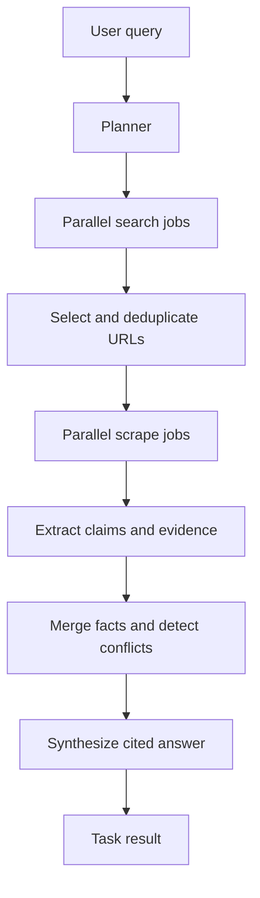
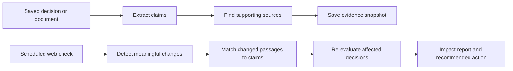

# Sequential AI Research

This document consolidates the product and architecture discussion for Sequential AI.
It explains the problem, the API model, the research pipeline, the role of Redis and BullMQ, how the design compares with Parallel.ai, and the feature direction that can make Sequential useful in real-world workflows.

## 1. Product Direction

Sequential AI is a web-research infrastructure platform for AI agents and business applications.

The core product should accept a research objective and return an answer that is:

- Current: grounded in live web information.
- Parallel: searches and reads multiple sources concurrently.
- Cited: every important claim points to evidence.
- Auditable: intermediate steps and source passages are inspectable.
- Honest: uncertainty, conflicts, and missing evidence are visible.
- Actionable: the result can recommend a decision or next action.

The initial product should focus on one strong capability instead of trying to implement every possible web API:

> Give an application a difficult research objective and return a parallel, cited, evidence-backed result.

## 2. The Real Problem

AI models know a large amount of historical information, but applications need current information from the web. A basic web-search integration creates several problems:

| Problem                     | Consequence                                                                   |
| --------------------------- | ----------------------------------------------------------------------------- |
| Sequential retrieval        | Research becomes slow as the number of sources increases.                     |
| Weak extraction             | JavaScript-heavy pages and PDFs may not be readable with normal HTTP fetches. |
| Unsupported answers         | A generated answer may not show which passage supports each claim.            |
| Stale research              | A report can become incorrect after a regulation, price, or policy changes.   |
| Hidden uncertainty          | Conflicting or low-quality sources may be silently combined.                  |
| Poor operational visibility | Developers cannot see which step failed or why.                               |

Sequential should solve these problems through orchestration, evidence tracking, and task observability.

## 3. Core Task API

The main public endpoint is:

```http
POST /v1/task
```

Example request:

```json
{
  "query": "What are the effects of ethanol blending in India?",
  "maxWorkers": 5,
  "maxSources": 10,
  "mode": "async"
}
```

For a long-running research operation, the endpoint should return a task identifier:

```http
202 Accepted
```

```json
{
  "taskId": "task_01J...",
  "status": "queued",
  "createdAt": "2026-07-22T10:00:00.000Z"
}
```

The task identifier connects the HTTP request, BullMQ jobs, retries, trace events, final answer, and future monitoring.

### Task retrieval

```http
GET /v1/task/:taskId
```

This returns the current status while the task is running and the complete result when it is finished:

```json
{
  "taskId": "task_01J...",
  "status": "completed",
  "query": "What are the effects of ethanol blending in India?",
  "answer": "...",
  "facts": [],
  "sources": [],
  "usage": {
    "subQueries": 4,
    "searched": 4,
    "scrapedPages": 8,
    "extractedFacts": 25
  }
}
```

The POST and GET endpoints are not unrelated endpoints. They represent the lifecycle of one resource:

```text
POST /v1/task          create and start a task
GET  /v1/task/:taskId  read the task state or result
```

This is necessary because research can take longer than an HTTP connection should remain open. If the browser closes or a proxy times out, the task can continue and the result can still be recovered with the task ID.

### Developer experience

The underlying API can be asynchronous while an SDK provides a one-call experience:

```js
const result = await client.tasks.run(
  "Research the effects of ethanol blending in India",
);
```

Internally, the SDK performs:

```text
POST /v1/task
  -> receive taskId
  -> poll GET /v1/task/:taskId
  -> return the completed result
```

For a user interface, the SDK can instead expose a stream of progress events.

## 4. Task Modes

The API can support three modes without changing the central task abstraction.

### Synchronous mode

```text
POST /v1/task
  -> wait for the pipeline
  -> return the final result
```

Useful for prototypes and short tasks, but not ideal for long research.

### Streaming mode

```text
POST /v1/task with stream=true
  -> return SSE events
  -> finish with the final answer
```

Example events:

```text
task_created
plan_completed
search_completed
scrape_completed
fact_extracted
synthesis_started
synthesis_chunk
done
```

Useful for chat interfaces and dashboards.

### Asynchronous mode

```text
POST /v1/task
  -> return taskId immediately
  -> process with BullMQ
  -> retrieve through GET or receive a webhook
```

This is the recommended default for production research.

## 5. Research Pipeline

The planner should not create extraction jobs before searching because relevant URLs are unknown at planning time.

The correct flow is:

```text
Original query
  -> plan sub-queries
  -> search sub-queries
  -> select and deduplicate URLs
  -> scrape selected URLs
  -> extract structured facts
  -> merge and compare facts
  -> synthesize final cited answer
```



### Stage 1: Planning

Input:

```json
{
  "query": "What are the effects of ethanol blending in India?"
}
```

Output:

```json
{
  "subQueries": [
    {
      "id": "subquery_1",
      "query": "India ethanol blending policy and targets",
      "purpose": "Find official targets and timelines"
    },
    {
      "id": "subquery_2",
      "query": "Benefits of ethanol blending in India",
      "purpose": "Find economic and environmental benefits"
    },
    {
      "id": "subquery_3",
      "query": "Problems with ethanol blended fuel in India",
      "purpose": "Find limitations and criticism"
    }
  ]
}
```

Planner output must be validated. Limit the number of sub-queries, reject empty queries, and remove duplicates.

### Stage 2: Search

Each sub-query becomes a search job. The existing `SearchWorker` calls Serper and returns normalized organic results.

```json
{
  "taskId": "task_01J...",
  "subQueryId": "subquery_1",
  "query": "India ethanol blending policy and targets"
}
```

Search results should be normalized to:

```json
{
  "url": "https://example.com/article",
  "title": "Ethanol policy in India",
  "snippet": "..."
}
```

### Stage 3: URL selection

Do not scrape every returned result. Select a bounded set of unique URLs.

Selection should eventually consider:

- Relevance to the original query.
- Source authority.
- Freshness.
- Geographic and jurisdictional relevance.
- Maximum sources per domain.
- URL canonicalization.

### Stage 4: Scraping

Each selected URL becomes a scrape job. The existing `ScraperWorker` uses Jina Reader and returns page content, title, description, links, and raw provider output.

```json
{
  "taskId": "task_01J...",
  "url": "https://example.com/article",
  "originalQuery": "What are the effects of ethanol blending in India?"
}
```

### Stage 5: Fact extraction

The fact extractor should return structured claims rather than another free-form summary:

```json
{
  "facts": [
    {
      "claim": "India has a target for 20 percent ethanol blending in petrol.",
      "evidence": "Exact supporting passage from the page.",
      "date": "2025",
      "confidence": 0.91,
      "sourceUrl": "https://example.com/article"
    }
  ]
}
```

Rules:

- Do not infer facts that are not supported by the page.
- Require an evidence passage.
- Require a source URL.
- Return an empty array when the page is not relevant.
- Validate structured model output before storing it.

### Stage 6: Fact merging

Merging should:

1. Normalize whitespace and claim text.
2. Remove exact and near duplicates.
3. Preserve all supporting sources.
4. Detect contradictions.
5. Prefer recent and authoritative evidence.
6. Keep uncertainty visible.

Contradictory claims must not be silently discarded.

### Stage 7: Synthesis

The synthesizer should receive structured facts, evidence passages, source metadata, and conflict information.

It should be instructed to:

- Use only supplied evidence.
- Cite claims with source numbers.
- Mention conflicting sources.
- Separate facts from uncertainty.
- Say when evidence is insufficient.

## 6. Redis and BullMQ

Redis and BullMQ are infrastructure, not separate user-facing products.

### Redis responsibilities

Redis should provide:

- BullMQ queue storage and coordination.
- Job locks and retry state.
- Temporary task state.
- Pub/sub channels for progress events.
- Rate-limit counters.
- Short-lived caches.

Redis should not be the permanent source of truth for research history. Completed tasks, claims, evidence, and reports should eventually be stored in PostgreSQL or another durable database.

### BullMQ responsibilities

BullMQ should provide:

- Background execution.
- Parallel fan-out.
- Per-stage concurrency limits.
- Retry and exponential backoff.
- Delayed and scheduled jobs.
- Job idempotency.
- Dead-letter handling.

Recommended queues:

```text
research.plan
research.search
research.scrape
research.extract-facts
research.merge
research.synthesize
research.notify
```

Recommended worker concurrency:

```text
Planning:        2
Searching:       5
Scraping:        5
Fact extraction: 3
Merging:         2
Synthesis:       2
```

Search and scraping are I/O-heavy. LLM stages should have lower concurrency because of provider rate limits and cost.

### Job flow

```text
POST /v1/task
  -> create task record
  -> enqueue research.plan
  -> return taskId

research.plan
  -> save plan
  -> enqueue one research.search job per sub-query

research.search
  -> save results
  -> select URLs after search completion
  -> enqueue research.scrape jobs

research.scrape
  -> save page content
  -> enqueue research.extract-facts jobs

research.extract-facts
  -> save claims and evidence
  -> enqueue research.merge when extraction is complete

research.merge
  -> merge claims and detect conflicts
  -> enqueue research.synthesize

research.synthesize
  -> save final result
  -> mark task completed
  -> publish done event
```

## 7. Task States and Failure Handling

Task states:

```text
queued
planning
searching
scraping
extracting
merging
synthesizing
completed
partial
failed
```

Retry temporary failures:

```text
Network errors
HTTP 429
HTTP 500-599
Temporary Redis failures
Temporary LLM provider failures
```

Do not retry permanent failures:

```text
Invalid query
Invalid URL
Unsupported protocol
Missing provider key
Blocked or unsafe URL
Malformed permanent request
```

A failed source should not necessarily fail the whole task. Use a coverage threshold:

```text
coverage = successful sources / requested sources

coverage >= 0.60 -> synthesize as partial or completed
coverage < 0.60  -> fail the task
```

## 8. Trace and Monitoring API

Every stage should produce a trace step:

```http
GET /v1/task/:taskId/trace
```

Example step:

```json
{
  "type": "scrape",
  "status": "failed",
  "url": "https://example.com",
  "error": {
    "code": "JINA_API_ERROR",
    "retryable": true
  }
}
```

Live events can be published to:

```text
task:{taskId}:events
```

The SSE endpoint is:

```http
GET /v1/monitor/:taskId
Accept: text/event-stream
```

The Monitor endpoint is an observability and recovery feature. It does not replace the main Task API.

## 9. How Parallel.ai Relates to Sequential

Parallel.ai exposes several products because different web workloads have different latency and output requirements.

| Parallel product | Main use                                            | Sequential equivalent            |
| ---------------- | --------------------------------------------------- | -------------------------------- |
| Search           | Fast current web context and relevant URLs          | `SearchWorker`                   |
| Extract          | Read a known URL, including JS-heavy pages and PDFs | `ScraperWorker`                  |
| Responses        | Fast synthesized conversational answer              | Future fast-answer mode          |
| Task             | Multi-hop research and structured enrichment        | Planned BullMQ research pipeline |
| FindAll          | Discover and verify matching entities               | Future entity-discovery pipeline |
| Entity Search    | Fast candidate discovery                            | Future fast entity search        |
| Monitor          | Repeated checks and webhook alerts                  | Future scheduled monitoring      |

Parallel's Task API also uses a task/run identifier concept. A developer may experience one SDK method, but internally the provider still needs background processing, state, retrieval, extraction, synthesis, and result retrieval.

Sequential can provide the same convenience through an SDK:

```js
const result = await client.tasks.run(query);
```

The SDK can internally create a task and poll or stream its result.

The goal is not to copy every Parallel product. The first goal is to build a more focused and auditable research workflow.

## 10. Recommended Differentiator: Decision Drift Monitor

Search, extraction, deep research, citations, and monitoring are already established product categories. A more distinctive feature is:

> Detect when a change on the web invalidates a previous business decision, document, or record.

A normal monitor says:

```text
A regulation page changed.
```

Decision Drift Monitor says:

```text
The regulation changed, and three saved compliance decisions are affected.
Two require review; one remains valid.
```

### Example use cases

#### Compliance

```text
Decision: Our product can be sold in India without additional certification.
```

After a regulation changes:

```text
Impact: High
Status: Needs review
Reason: The certification exemption was removed.
Recommended action: Send the product to compliance review.
```

#### Procurement

```text
Decision: Supplier X is the lowest-cost supplier.
```

After pricing or shipping terms change:

```text
Supplier X is no longer the lowest-cost option for three active contracts.
```

#### Sales

```text
Record: Company A uses competitor B.
```

After public information changes:

```text
Company A may now be a qualified prospect.
```

### Why this stands out

This changes the product from:

```text
A tool that finds web changes
```

to:

```text
A system that explains which business decisions are affected by web changes
```

That solves a concrete problem in compliance, finance, procurement, sales, legal operations, and competitive intelligence.

### Decision Drift flow



### Decision Drift data model

```text
tracked_decisions
- id
- name
- decision_text
- status
- confidence
- check_frequency
- next_check_at

 decision_claims
- id
- decision_id
- claim
- importance
- confidence

 decision_sources
- id
- decision_id
- url
- last_content_hash
- last_checked_at

 change_events
- id
- decision_id
- changed_claim
- impact
- explanation
- recommended_action
- detected_at
```

### First MVP

Start with regulatory and policy changes:

```text
1. User submits a decision and source URLs.
2. Scrape the sources.
3. Extract claims and evidence.
4. Save a snapshot.
5. Schedule a BullMQ repeatable job.
6. Scrape the sources again.
7. Compare the new content with the snapshot.
8. Identify affected claims.
9. Re-evaluate the decision.
10. Send a webhook or display an alert.
```

## 11. Implementation Roadmap

### Phase 1: Queue foundation

- Add BullMQ and `ioredis`.
- Add `REDIS_URL` configuration.
- Create Redis connection and queue factories.
- Add queue health checks.
- Verify a test job can be enqueued and consumed.

### Phase 2: Task lifecycle

- Add `POST /v1/task`.
- Validate query and options.
- Generate a task ID.
- Store initial task state.
- Enqueue the planning job.
- Add `GET /v1/task/:taskId`.

### Phase 3: Research pipeline

- Add planner worker.
- Fan out search jobs.
- Reuse the existing `SearchWorker`.
- Select and deduplicate URLs.
- Fan out scrape jobs.
- Reuse the existing `ScraperWorker`.
- Add fact extraction.
- Add fact merging and contradiction detection.
- Add synthesis.

### Phase 4: Persistence and observability

- Add PostgreSQL task and trace storage.
- Store sources, claims, evidence, and final answers.
- Add Redis progress events.
- Add SSE monitoring.
- Add usage and cost tracking.

### Phase 5: Decision Drift Monitor

- Add tracked decisions.
- Add source snapshots and semantic diffs.
- Match changes to claims.
- Calculate decision impact.
- Add scheduled checks and webhooks.

### Phase 6: Production hardening

- API key authentication.
- Per-user and per-organization rate limits.
- SSRF protection.
- Request and response size limits.
- Timeouts and redirect limits.
- Idempotency keys.
- Dead-letter queues.
- Structured logs and metrics.
- Webhook signature verification.

## 12. Security Requirements

Because the system reads arbitrary URLs, production scraping must include:

- Allow only `http` and `https`.
- Block localhost and private IP ranges.
- Block cloud metadata addresses such as `169.254.169.254`.
- Limit redirects.
- Enforce connection and response timeouts.
- Limit page size.
- Rate-limit tasks and sources.
- Avoid storing secrets in task payloads.
- Scope task and evidence access by organization.

## 13. Testing Strategy

### Unit tests

Test:

- Query validation.
- Planner output validation.
- URL deduplication.
- Source selection limits.
- Retry classification.
- Fact normalization.
- Fact merging.
- Contradiction detection.
- Snapshot comparison.

### Worker tests

Test:

- Search jobs call `SearchWorker`.
- Scrape jobs call `ScraperWorker`.
- Job retries use the correct policy.
- Every job carries the correct `taskId`.
- Task state transitions are valid.
- Failed sources produce partial results when coverage allows it.

### Integration tests

Use mocked providers for the normal suite:

```text
POST /v1/task
  -> plan
  -> search
  -> scrape
  -> extract facts
  -> merge
  -> synthesize
  -> completed result
```

Keep real Serper and Jina checks separate from the normal test suite, consistent with the existing worker checks.

## 14. Product Principle

The long-term product promise is:

> Sequential keeps important research correct after the web changes.

The first implementation should remain focused: build the Task API and evidence-backed research pipeline with Redis and BullMQ, then add Decision Drift Monitor after the basic task lifecycle is reliable.
